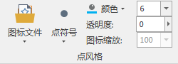
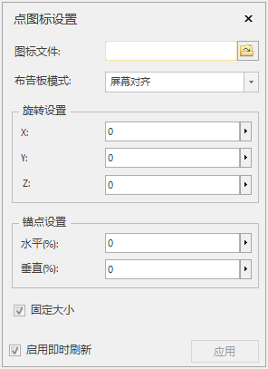
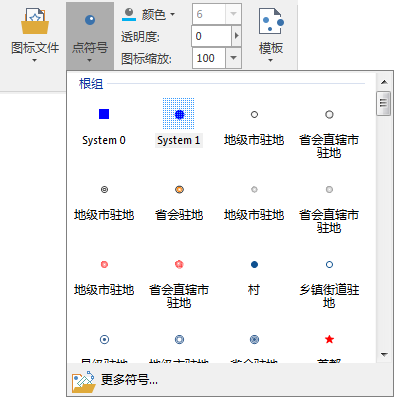
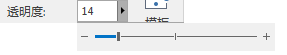
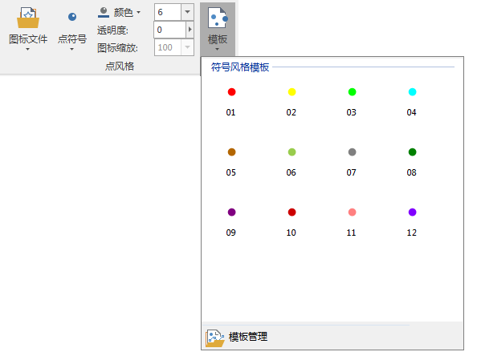

**使用说明**

“风格设置”选项卡的“点风格”组，组织了对场景中点数据集类型的三维图层中的点对象设置点符号风格的功能。所有符号风格的设置都会实时应用到选中的三维图层中，即所见即所得。  
  
  
**操作步骤**

### 图标文件

“图标文件”命令将用于设置或清除场景中添加的点数据集显示的图标文件。注意：只有选中图层为点数据集类型的三维图层，“点风格”组中的功能控件才可用；否则，该项不可用。

  1. 单击“ **风格设置** ”选项卡上的“ **点风格** ”组的“ **图标文件** ”下拉按钮，在弹出的下拉菜单中选择“ **设置** ”项。  
    
  2. 弹出如上图所示的“点图层设置”面板，在“图标文件”处指定一个图标文件（图标文件格式包括：*.png、*.jpg、*.jpeg、*.bmp、*.3ds、*.sgm，其中*.sds 和*.sgm 是模型符号）。
  3. 在“布告板模式”处，用户通过下拉箭头选择布告板模式，提供3种模式：屏幕对齐、贴地旋转、自由旋转。
  4. 在“旋转设置”处，用户直接输入X、Y、Z方向的旋转角度值，或者鼠标单击向右箭头，弹出滑块，滑动滑块进行设置旋转角度。
  5. 在“锚点设置”处，用户可以调整添加的图标与源数据点的水平和垂直相对位置关系，默认位置：添加图标的左下角与源数据点对齐，锚点的单位为：%，值域为[-100，100]。  
     - **水平** ：正值表示往右偏移，负值表示往左偏移，例如设置为100%，表示图标文件往右偏移图标文件长度的距离。  
     - **垂直** ：正值表示往上偏移，负值表示往下偏移，例如设置为100%，表示图标文件往上偏移图标文件宽度的距离。  
  6. 若需要固定图标的大小，勾选“固定大小”复选框，默认为勾选状态。
  7. 若需要启动即时刷新，保证修改参数后，场景中的点图标设置效果实时更改，方便预览，勾选“启动即时刷新”，默认为勾选状态。
  8. 当需要删除已经设置的点图标文件，单击“ **风格设置** ”选项卡上的“ **点风格** ”组的“ **图标文件** ”下拉按钮，在弹出的下拉菜单中选择“ **清除** ”项，点符号风格恢复系统默认的风格。

### 点符号

“点符号”命令将用于设置三维场景中点数据集的点状符号的样式。

  1. 单击“ **风格设置** ”选项卡中“ **点风格** ”组的“ **点符号** ”下拉按钮，弹出如下图所示的点符号资源列表。列表的上部分显示出了用户最近使用的符号，列表的下部提供了系统默认的根组符号库，用户可根据需要选择符号列表中的符号作为当前点图层中点对象的符号样式；
  2. 用户还可以单击点符号资源列表底部的"更多符号"按钮，在弹出的“点符号选择器”窗口中，设置点对象的符号样式。
  3. 当用户选择了某个点状符号样式后，当前点图层中的所有点对象都会按选中的点状符号样式在三维球体上以“公告牌”的形式实时显示。  
  

### 颜色

“颜色”命令用于设置点符号的显示颜色。单击右侧的颜色按钮，在弹出的颜色面板中选择和设置点符号的颜色。

如果点符号已制定以一个图标文件显示，则设置点符号颜色后，点符号的图标将覆盖一层此处设置的颜色；如果设置点符号的颜色为白色，则点符号图标显示为原始图片的颜色。

### 透明度

“透明度(%)”命令用于设置点符号的透明效果。用户可在该标签右侧的数字显示框中输入数值；也可单击数字显示框右侧的箭头，调整弹出的滑块来设置透明度。透明度的数值为
0 至 100 之间的任意一个整数，0 代表完全不透明；100 代表完全透明。

  
---  
  
### 符号大小

如下图所示的组合框用于设置点符号的显示大小。注意：只有当在“图标文件”项中不指定任何图标文件时，该项才为可设置状态。

  
---  
  
在符号大小设置的组合框中输入数值，单击 Enter（回车）键即可应用所作的设置；或选择组合框下拉列表中提供的参考值设置符号大小。符号大小的数值单位为：像素。

### 图标缩放

当采用图标来代替点符号时，该项用来设置图标的缩放比率。通过在其右侧的组合框中输入数值，按
Enter（回车）键即可应用所作的设置；也可以选项组合框下拉列表中提供的参考值来设置。符号缩放的数值单位为：百分比（%）。只有点符号使用了图标文件代替点符号时，该项的设置才可用。

### 模板

“模板”命令用于将模板库中的点风格应用于当前点图层。

  1. 单击“ **风格设置** ”选项卡中“ **点风格** ”组的“ **模板** ”下拉按钮，弹出如下图所示的点风格模板列表。列表的上部分显示了用户最近使用的点风格模板，下部分显示了当前系统中所有的点风格模板，用户可根据需要选择列表中的模板风格作为当前点图层中点对象的风格。
  2. 当用户选择了某个模板风格后，当前点图层中的所有点对象都会按选中的模板风格实时显示。
  3. 点风格模板库保存在安装目录下Templates\Style3D\Marker 文件夹下，如果该文件夹为空，则模板列表为空。  
  

**相关主题**

[符号风格设置区域](../../Visualization/LayerStyle/ManagerUISymStyle)  
 [保存为风格模板](../SceneTemplate/DTv_StyleSave)

 

