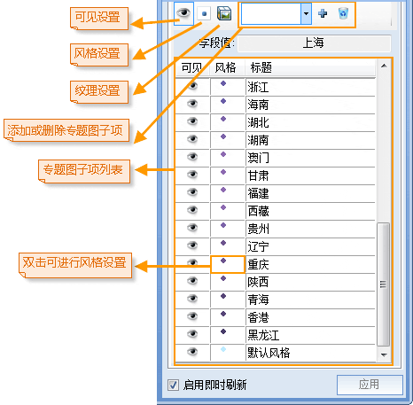

---
id: UniqueMap3DGroupDia
title: 修改三维单值专题图  
---  
### 使用说明

用户可以在“三维单值专题图”窗口中修改单值专题图的风格，下面介绍下如何修改三维单值专题图。

### 操作步骤

动态“界面”演示  

>  

  
  1. **选择专题图图层：** “三维单值专题图”窗口中的“专题图图层”下拉框中选择当前要编辑的专题图图层。
  2. **设置单值表达式：** 在“单值表达式”选框里设定当前单值专题图的专题变量，同时可以在下拉选框中的[表达式](../../Query/SQLDia)里自定义专题变量。
  3. **设置颜色方案：** 在”颜色方案“选框中选择渐变色带，从而改变当前三维单值专题图的整体颜色风格。也可以通过下拉选框中的[自定义](../../Visualization/LayerStyle/AddColorRamp)选项定制自己喜欢的色带风格。
  4. **设置专题图子项是否可见：** 参照动态界面，选中单个或多个专题图子项后可以单击 “可见”  图标按钮设置选中的专题图子项是否可见。也可以通过单击专题图子项前的 激活态图标调整每个子项的可见性。
  5. **设置专题图子项显示风格：** 参照动态界面演示，选中单个或多个专题图子项后可以单击“风格”按钮进行风格设置，点图层专题图可通过单击 “点风格” 按钮激活[点符号选择器](Symbol3Dgroup)，线图层专题图通过单击 “线风格”按钮激活[线型符号选择器](Line3Dgroup)，面图层专题图通过单击“风格”按钮激活[填充符号选择器](Fill3Dgroup)。
    * 多选专题图子项可以按下 **Ctrl** 键，然后依次点选专题图子项，选完后放开 **Ctrl** 键，或按下 **Shift** 键单击专题图子项列表中预选的头项和尾向，可以选中头尾之间所有专题图子项，选好后放开 **Shift** 键。
    * 选好多个专题图子项后单击工具条中“风格”设置按钮，弹出“修改专题图子项风格”对话框，可在此选择要修改的项，进行批量修改具体操作请参见：[修改专题图项风格](Thematic3DSymbolStyle)。 
  6. **设置专题图子项扩展属性：** 选中要进行贴图设置的单个或多个专题图子项，单击 “设置子项扩展属性”图标按钮，弹出“专题图子项扩展属性设置”窗口，可以进行三维专题图的扩展属性设置。具体内容请参见[专题图子项扩展属性设置](Thematic3DTexture)。
  7. **添加或删除专题值：** 参照动态界面，“添加” 按钮用于添加一个专题图子项，“删除”按钮用于删除一个专题图子项，选中专题图子项列表中待删除的子项，单击工具条中的 “删除”按钮，删除所选项。删除该子项后原专题图子项对应的对象将恢复默认风格。删除后的子项将显示于下拉列表中，选中其中子项可配合 “添加”按钮，将已删除的专题图子项再次添加到专题值列表中。 
  8. **字段值：** 字段值后的编辑框仅用于显示选中的专题图子项的字段值。
  9. **设置专题图子项的标题内容：** 专题图子项的标题内容可以修改，选中要编辑的专题图子项的标题内容后单击标题内容文本框变成可编辑状态。
  10. **即时刷新设置：** 默认情况下“启用即时刷新”设置时开启的，用户对专题图图层的每一步风格设置都会即时的显示在场景中 用户也可以取消“启用即时刷新”勾选框不启用实时刷新，通过单击“应用”按钮，将用户定制的参数设置应用于当前专题图。

### 备注

  * 用户通过制作和修改的三维专题图都可以保存为模板，以便应用到其他三维图层的专题图制作中，保存专题图模板具体操作请参见：[保存为专题图模板](Theme_SaveThemeTempl)。
  * 对专题图中涉及到的几个概念进行简单解释。 

专题变量：专题图属性表中的查询字段或字段表达式。

专题图子项：单值专题图是将专题值相同的要素归为一类，为每一类设定一种渲染风格，其中每一类就是一个专题图子项。

专题值：专题变量对应的值，称为专题值。

###  相关主题

 [新建三维单值专题图](UniqueMap3DDefault)

 [基于模板制作三维单值专题图](UniqueMap3DTemplate)

 [保存到专题图模板库](Theme_SaveThemeTempl)

