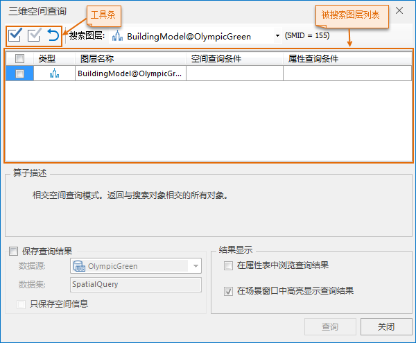

###  使用说明

三维空间查询涉及查询图层、查询条件和查询对象，实现在查询图层中查询与指定查询对象具有查询条件的所有模型对象。

目前支持点、模型对象的空间查询。

###  操作步骤

  1. 在场景窗口中选择查询对象，可以是单个点或模型，或者是多个点或模型。
  2. 在“ **空间分析** ”选项卡上“ **查询** ”功能组中，单击“ **空间查询** ”下拉按钮，在弹出的下拉菜单中单击” **三维空间查询** “，弹出”三维空间查询”对话框，如下图所示。
  
---  
图：“三维空间查询”对话框

    * 选择的查询对象所在的图层会自动加载进“搜索图层”下拉列表和被搜索图层列表内。
    * 支持在场景中修改查询对象，搜索图层列表和被搜索图层列表内信息会实时更新。
  3. 通过工具条可批量选中或不选中被查询图层，也可以自主勾选或取消勾选被查询图层。
  4. 在搜索图层列表中选择最终查询对象所在的图层，图层ID（SMID）会实时更新。
  5. 设置查询条件，包括空间查询条件和属性查询条件。 
    * **属性查询条件：** 在被搜索图层列表中，单击“属性查询条件”下拉按钮，弹出“SQL表达式”对话框，构建被搜索图层的属性字段查询条件，即满足条件的对象参与空间查询。当不设置属性查询条件，则图层中所有对象参与空间查询。
    * **空间查询条件：** 在被搜索图层列表中，单击“空间查询条件”下拉按钮，在下拉列表中选择一个系统支持的空间查询算子。目前，应用程序支持的空间查询算子共有6种，分别是：包含、分离、重合、相交、被包含、包含或相交。选中相应的空间查询算子，被搜索图层列表下即显示对应的算子描述。
  6. 设置查询结果保存方式。当勾选“保存查询结果”，可设置存储的数据源和数据集，以及是否只保存空间信息。 
    * **数据源：** 用于设置和显示查询结果所要保存的目标数据源。下拉列表中列出了当前工作空间中所有非只读数据源，用户可指定一个保存结果数据集的目标数据源。
    * **数据集：** 用于设置和显示新数据集的名称，默认名称为：SpatialQuery。
    * **只保存空间信息：** 勾选“只保存空间信息”复选框，设置只保存查询结果的空间信息，不保存其属性信息。
  7. 设置查询结果显示方式。默认勾选“在场景窗口中高亮显示查询结果”，当同时勾选2个复选框，可实现二三维联动浏览查询结果。 
    * **在属性表中浏览查询结果：** 选中该复选框，则查询结果以属性表形式打开。
    * **在场景窗口中高亮显示查询结果：** 选中该复选框，则可在场景窗口中高亮显示查询结果。
  8. 完成各项设置后，单击“查询”按钮，执行空间查询操作。
  9. 单击“关闭”按钮，关闭空间查询对话框。

### 注意事项

  1. 只有当前场景中存在非空的点或模型数据集时，“三维空间查询”功能按钮为可用状态。
  2. 只有当搜索对象与被搜索图层在相同的坐标系下，才能进行空间查询操作。

* * *

|

  
  
---

