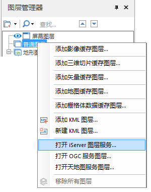

**使用说明**

“打开 iServer 服务图层”命令，用来将已发布的 iServer 服务场景中的数据添加到场景中，作为场景中的图层。

**操作步骤**
  1. 启动 iServer 服务后，在  中打开或新建一个场景，在“图层管理器”的“普通图层”结点处，单击鼠标右键，在右键菜单中选择“打开iServer服务图层...”，弹出“打开iServer服务图层”对话框。  
  

  2. 服务地址：在文本框中输入 iServer 服务图层发布的地址。若“图层类型”设置为 Map，则服务地址需设置到图层名称层级，例如，需打开图层为World，图层类型为 Map ，则服务器地址需填写“http://localhost:8090/iserver/services/map-world/rest/maps/World”；若“图层类型”为其他类型，则服务地址需设置到服务根节点，如图层类型为 Vector，则服务器地址需设置为“http://localhost:8090/iserver/services/3D-Pipe3D/rest/realspace”。
  3. 场景名称：输入通过 iServer 发布的服务场景名称。
  4. 图层名称：输入通过 iServer 发布的服务图层名称。
  5. 图层类型：选择打开的 iServer 服务图层的类型，支持是的图层类型有：Image、KML、Map、Vector、OSGB 五种，具体说明如下： 
       * Image：表示打开发布的图层子图层类型为影像图层。
       * KML：表示打开发布的图层子图层类型为 KML 图层。
       * Map：表示打开发布的地图图层，服务地址需填写发布到 iServer 服务上的图层链接。
       * Vector：表示打开发布的图层子图层类型为矢量图层。
       * OSGB：表示打开发布的图层子图层类型为 OSGB 图层。

6. 单击“确定”按钮，即可将数据作为场景中的一个三维图层显示在场景中的模拟地球上，同时，在图层管理器中的“普通图层”子结点将增加一个三维图层结点，该结点对应刚打开的 iServer 服务图层。

  

 

