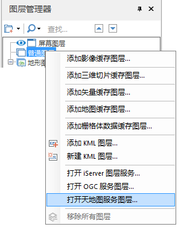

---
id: OpenMapWorld
title: 打开天地图服务图层  
---  
### 使用说明

天地图服务是国家测绘局为公众提供权威、可信、统一的地理信息服务，是目前中国区域内数据资源最全的地理信息服务网站。天地图网站提供了海量基础地理信息资源，包括全球范围的矢量地形服务和遥感影像、全国范围的地图数据，导航电子地图数据，部分城市三维街景数据。具体说明请参见[天地图服务](../../TechDocument/WebDatasets/AboutWebDataset#5)。

“打开天地图服务图层”功能只支持打开天地图服务中的 WMTS 服务的图层。

### 操作步骤

  1. 打开天地图服务有两种方式： 
      * 方式一 
        * 启动 iServer 服务后，在  中打开或新建一个场景，在“ **场景** ”选型卡的“ **数据** ”组内“ **在线地图** ”下拉按钮中，单击“天地图”按钮，弹出“打开天地图服务图层”对话框。
      * 方式二 
        * 启动 iServer 服务后，在  中打开或新建一个场景，在“图层管理器”的“普通图层”结点处，单击鼠标右键，在右键菜单中选择“打开天地图服务图层...”，弹出“打开天地图服务图层”对话框。
   
"打开天地图服务图层..."按钮位置  

* 服务地址：输入 WMTS 服务的天地图图层发布的地址，例如：“http://localhost:8090/iserver/services/map-china400/wmts-china”。
* 图层名称：输入发布的天地图服务图层的名称，图层名称需填写服务地址中 Layer 的 Title，与发布的图层名称一致。
* DPI：用于设置添加到场景中服务图层的分辨率。
* 图片类型：选择在场景中打开天地图的图片类型，以指定的图片类型打开天地图。
* 密钥：输入用户发布天地图服务图层时设置的Token密钥，输入不正确就无法打开天地图。
* 单击“确定”按钮，即可将数据作为场景中的一个三维图层显示在场景中的模拟地球上，同时，在图层管理器中的“普通图层”子结点将增加一个三维图层结点，该结点对应刚打开的天地图服务图层。

  

