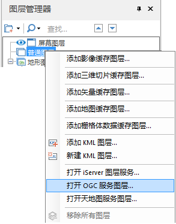

---
id: OpenOGC
title: 打开 OGC 服务图层  
---  
### 使用说明

OGC（Open Geospatial Consortium）是开放地理空间组织，它是地理空间及位置服务领域进行标准制定的业界领袖。OGC 服务包括
WMS、WMTS 两种服务，具体说明请参见[OGC
服务](../../TechDocument/WebDatasets/AboutWebDataset#1)。

### 操作步骤

  1. 启动 iServer 服务后，在  中打开或新建一个场景，在“图层管理器”的“普通图层”结点处，单击鼠标右键，在右键菜单中选择“打开OGC 服务图层...”，弹出“打开OGC服务图层”对话框。   
  
"打开OGC服务图层..."按钮位置  
  2. 服务地址：在文本框中输入 OGC 服务图层发布的地址。若“图层类型”设置为 WMS，则服务地址需设置到图层名称层级，例如，需打开图层为 China，则服务器地址需填写“http://localhost:8090/iserver/services/map-china400/wms111/China”，；若“图层类型”为 WMTS，则服务地址需设置到发布图层级别：“http://localhost:8090/iserver/services/map-china400/wmts-china”。
  3. 图层名称：输入通过 iServer 发布的服务图层的名称。若打开的为 WMS 服务图层，则该名称作为图层的别名，可与发布时的图层名称不一致；若打开的为WMTS服务图层，则图层名称需填写服务地址中 Layer 的 Title，与发布的图层名称一致。
  4. 图层类型：选择打开的 iServer 服务图层的类型，支持是的图层类型包括 WMS、WMTS 两种服务图层。
  5. 单击“确定”按钮，即可将数据作为场景中的一个三维图层显示在场景中的模拟地球上，同时，在图层管理器中的“普通图层”子结点将增加一个三维图层结点，该结点对应刚打开的 OGC 服务图层。

  

