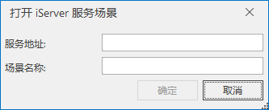

---
id: Scenes_OpenIServer
title: 打开 iServer 服务场景  
---  
### 使用说明

“打开 iServer 服务场景”命令，用来打开一个通过 iServer 服务发布的场景。

### 操作步骤

  1. 右键单击工作空间管理器中的场景集合结点，在弹出的右键菜单中选择“ **打开 iServer 服务场景** ”命令。
  2. 弹出“打开 iServer 服务场景”对话框，在该对话框中输入要打开的 iServer 服务场景的信息，然后，单击对话框中的“确定”按钮即可打开 iServer 服务场景。   
  
  
      * 服务地址：输入该场景发布的服务地址。
      * 场景名称：输入 iServer 发布的服务场景的名称。该场景名称必须与发布场景时的名称一致。

### 备注

1. 当请求打开场景服务，其 URL（即 iServer 服务地址）为 http://服务地址:端口号/iserver/services/realspace-工作空间名称/rest/realspace，例如：http://localhost:8090/iserver/services/realspace-sample/rest/realspace。

  

