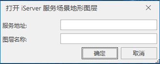

**使用说明**

“打开 iServer 服务场景地形图层”命令，用来将发布的 iServer 服务场景中的地形数据添加到场景中，作为场景中的地形图层。

**操作步骤**

  1. 右键单击图层管理器中的地形图层根结点，在弹出右键菜单中选择“ **打开 iServer 服务场景地形图层** ”命令。
  2. 弹出“打开 iServer 服务场景地形图层”对话框，输入你所发布的 iServer 服务场景中的地形数据的地址和名称，然后单击对话框中的“确定”按钮即可打开该地形数据。   
     

       * 服务地址：输入 iServer 服务地形图层发布的地址。
       * 图层名称：输入通过 iServer 发布的服务的地形图层的名称。该名称作为图层的别名，可与发布时的图层名称不一致。
  3. 新加载的地形数据作为场景中的一个地形图层显示在场景中的模拟地球上，同时，在图层管理器中将增加一个“地形图层”的子结点，该结点对应着刚打开的 iServer 服务场景地形数据图层。

**备注**

当请求场景服务地形图层时，URL（iServer服务地址）为 http://服务地址:端口号/iserver/services/realspace-工作空间名称/rest/realspace/datas/地形图层名称，http://localhost:8090/iserver/services/realspace-sample/rest/realspace/datas/Beijing@RealspaceSample_Terrain。

  

 

