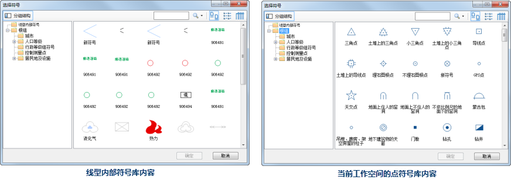
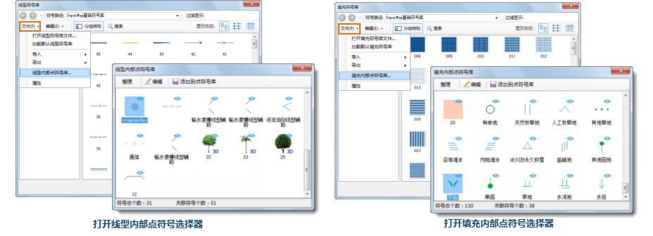

## 内部点符号

内部点符号分为两种，一个是线型内部点符号和填充内部点符号：

* 线型内部点符号:在线型符号编辑器中进行线型符号的制作或编辑时，通常会选择一些点符号作为线型符号的组成元素，如：制作符号类型的子线，会选择构成子线的点符号；设置子线的端头符号时，也会选择点符号作为端头符号，类似于这些被选择作为构成线型符号的点符号，称为线型内部点符号。此外，在制作三维线型时，会选择三维点符号来制作模型类型的子线，或者在制作截面类型的子线时，将会绘制截面，这些三维点符号或者所绘制的截面也是线型内部点符号。
* 填充内部点符号:在填充符号编辑器中进行填充符号的制作或编辑时，在制作符号填充类型的子填充时，会选择点符号作为构成该子填充的填充内容，这些被选择作为填充内容的点符号称为填充内部点符号。

在制作线型或者填充符号时，在选择点符号作为使用的内部点符号时，将从当前工作空间中的点符号库中选择需要的点符号，并且这些选择作为内部点符号的符号将保存到相应的线型或填充内部点符号库中进行独立管理。这样，如果当初选择作为内部点符号的点符号被删除，也不会影响由该点符号构成的线型或者填充符号，因为，内部点符号都从内部点符号库中获取。

如下面的例子展示内部符号的概念，下面为在制作线型符号时，选择某个点符号作为线型符号中某子线的端头符号。

1. 下图是为当前选中的子线添加首部的端头符号，通过如下图所示的下拉菜单项，打开“选择符号”对话框，可以选择需要的点符号。    
  

2. 上一步打开的“选择符号”对话框如下图所示，该对话框以符号选择器的模式展示其中的点符号，这些点符号分为两部分，如对话框的符号分组结构树所示，根组（“线型内部符号”）为当前线型符号库中的线型符号所使用的所有内部点符号，即当前线型符号库所对应的 **线型内部点符号库** 中的点符号；另一部分是根组下面的所有内容，为当前工作空间中的点符号库，并保持点符号库的分组结构不变。 

这里既可以选择线型内部符号分组下的符号作为子线的端头符号，也可以选择工作空间的点符号库中的其他点符号作为端头符号。如果在“选择符号”对话框中选择了工作空间的点符号库中的点符号作为子线的端头符号，那么在完成线型符号的制作后，所选择的点符号会拷贝到线型符号库对应的线型内部点符号库中。

 |   
---|---  
线型内部符号库内容 | 当前工作空间的点符号库内容  

对于填充符号库，也有一个对应的填充内部点符号库，用来保存填充符号库中的填充符号所使用的所有内部点符号。例如，在选择符号类型的子填充所使用的点符号时，也将打开如上图所示的“选择符号”对话框，其结构也是分为两部分，一个是根组（“填充内部符号”）为当前填充符号库所对应的
**填充内部点符号库**
中的点符号；另一部分是根组下面的所有内容，为当前工作空间中的点符号库，并保持点符号库的分组结构不变。如果在“选择符号”对话框中选择了工作空间的点符号库中的点符号作为填充内容，那么在完成填充符号的制作后，所选择的点符号会拷贝到填充符号库对应的填充内部点符号库中。

## 管理内部点符号库

内部点符号库也相应地分为两种，一是，线型内部点符号库，即线型符号库对应的内部点符号库；二是，填充内部点符号库，即填充符号库对应的内部点符号库。SuperMap
提供了管理器用来对内部点符号库进行管理，管理器包括：线型内部点符号选择器，用来管理线型内部点符号库；填充内部点符号选择器，用来管理填充内部点符号库。

线型内部点符号选择器和填充内部点符号选择器，对于内部点符号的管理是一样的，这里以线型内部点符号库的管理为例，介绍内部点符号选择器的使用。

### 打开内部点符号选择器

在线型符号库管理或者填充符号选择器中，通过“文件”下拉菜单中的“线型内部点符号库”/“填充内部点符号库”项，即可打开相应的内部点符号选择器。

 |   
---|---  
打开线型内部点符号选择器 | 打开填充内部点符号选择器  

内部点符号选择器可以实现内部点符号的编辑以及实现内部点符号库整理操作。下面以线型内部点符号库的管理为例进行说明，填充内部点符号库的管理同线型内部点符号库管理。

### 整理内部点符号库

如下图所示的线型内部符号库管理中，有些点符号有“”标记，有些符号没有改标记，该标记表示内部点符号库中的点符号被线型符号库中的线型符号所使用着，即“关联”着，而没有该标记的点符号表示当前线型符号库的线型符号没有使用该点符号作为内部符号，因此，有“”标记的内部点符号不能被删除，而没有该标记的内部点符号可以通过删除操作删除。

单击管理器上方的“整理”按钮，可以实现整理当前内部点符号库的操作，整理操作主要是通过删除没有被使用的内部点符号（当前线型符号库中的线型符号没有使用到的内部点符号，即没有“”标记标识的内部点符号）来最小化内部点符号库的体积，同时整理操作还对当前内部点符号库中的所有内部点符号的符号编号进行重新编号，重新编号后，内部点符号的符号编号从1开始连续编号。

单击“整理”按钮后，会弹出如下提示框，提示用户慎重操作。

  
---  

### 编辑内部点符号

在内部点符号库中，可以对其中的内部点符号进行进一步的编辑操作，并且所做的编辑结果同样会体现到该内部点符号所关联的线型或填充符号（即：使用该点符号作为组成部分的线型符号或者填充符号）。

例如，如果线型符号库中的线型1使用了工作空间中点符号库中的点符号 A 作为端头符号，该点符号也保存到了线型内部点符号库中（这里称为点符号
AA），然后在线型内部点符号库中修改了点符号 AA 图形样子，那么，线型1的端头符号也将更新为点符号 AA 的最新图形样子，而工作空间中点符号库中的点符号
A 不会受到任何影响。

在内部点符号选择器中，选中要进行编辑的某个内部点符号，然后单击管理器上方的“编辑”按钮，即可打开点符号编辑器。如果选中的是二维点符号，打开的是二维点符号编辑器；如果选中的三维点符号，打开的是三维点符号编辑器。

### 拷贝内部点符号到点符号库

内部点符号库是独立管理的，对于线型符号库对应的线型内部点符号库和填充符号库对应的内部点符号库，它们之间也是独立的，并且内部点符号库没有提供导出功能，因此，为了满足线型内部点符号库和填充内部点符号库间的共享，以及实现内部点符号的导出，这里提供了可以将内部点符号库中选中的点符号拷贝到当前资源中的点符号库中的功能。具体操作为：

在内部点符号库（线型内部点符号库或填充内部点符号库）管理器中，选中一个需要拷贝到点符号库中的内部点符号，右键鼠标，在弹出的菜单中选择“添加到点符号库”项，即可将选中的内部点符号拷贝到当前资源中的点符号库的根组下，用户可以通过点符号选择器的功能实现该点符号的导出，也能通过点符号库实现线型内部点符号库或填充内部点符号库的资源共享。
