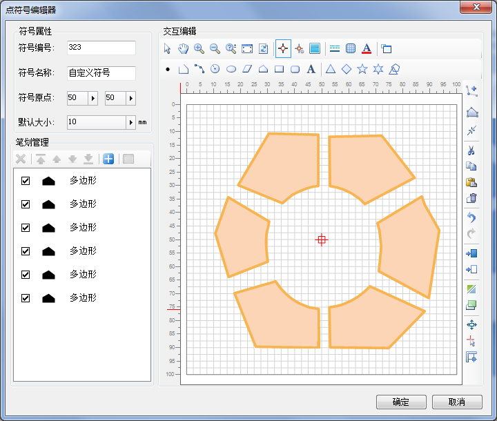

点符号库中的点符号，既可以通过 SuperMap
提供的点符号编辑器制作，又可将已有的其他资源导入为点符号，还可将地图中选中对象保存为点符号。支持输出为点符号的对象包括：点对象、线对象、多边形对象、文本对象四种二维对象

在地图窗口中选中需输出为点符号的对象，单击鼠标右键，选择“输出为点符号”，即可将选中对象添加到“点符号编辑器”中，用户可对符号风格、图形进行调整，具体操作请参见[编辑点符号](SymMarkerManager8.html)页面。

  
  
  
设置好点符号风格之后，单击“确定”按钮，即可讲点符号保存到当前工作空间中，在配图时，可在点符号选择器中选中该符号，将其应用于点图层风格。
