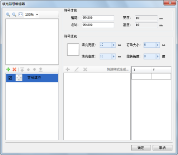

## 填充符号编辑器

填充符号编辑器，提供了制作新的填充符号或者编辑已有的填充符号的场所。在填充符号编辑器中，用户可以通过界面交互的方式，方便、快速、准确地完成填充符号的编辑。

  
---  
填充符号编辑器  
  
## 如何使用填充符号编辑器

下面的表格是将填充符号编辑器所提供的功能进行分类，每一部分包含了填充符号编辑器的若干项功能点。用户可以使用下面的表格定位所需要了解的功能的使用方法。

功能分类 | 包含的功能点介绍  
---|---  
[填充符号的构成](SymFillEditor0.htm) |
填充符号由子填充构成，子填充分为图像填充和符号填充两种。这里主要介绍填充符号的构成及符号填充的样式。  
[打开填充符号编辑器](SymFillEditor1.htm) | 介绍如何通过填充符号选择器打开填充符号编辑器。  
[填充符号编辑器界面简介](SymFillEditor2.htm) | 介绍填充符号编辑器界面的主要构成。  
[填充符号子填充管理](SymFillEditor3.htm) | 主要介绍子填充的添加、移除和顺序调整。  
[子填充风格设置](SymFillEditor4.htm) |
分别对图像填充和符号填充的风格设置进行介绍，如填充宽度和高度、符号大小、分辨率、颜色，以及符号填充的样式设置等。  
[保存符号编辑成果](SymFillEditor5.htm) | 介绍如何保存填充符号的编辑成果。  
  
