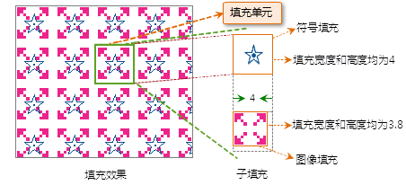

构成填充符号的基本元素是子填充，填充符号可以由一个或多个子填充构成，因此，在填充符号编辑器中，可以通过设置子填充的风格或样式来构建所需的填充符号。子填充有图像填充和符号填充两种类型，填充符号可以由若干个图像填充或符号填充构成。下图展示了子填充构成填充符号的基本方式。

如下图所示，制作某个填充符号，其由两个子填充构成：子填充1为符号填充类型，子填充2为图像填充类型，根据所制作的填充符号的要求，分别对子填充进行设置，如为图像填充选择图像，设置符号填充所使用符号的风格和样式，设置子填充的填充高度和宽度等，来完成该填充符号的制作。

 

构成方式：设置子填充1（符号填充类型）的符号填充宽度和高度为：4 mm，符号大小为：2 mm，旋转角度为：0
度，符号样式为在坐标（20，20）处添加一处符号；子填充2（图像填充类型）的图像填充宽度和高度均为：3.8 mm，分辨率为： DPI81。

   

## 子填充类型和大小

### 子填充类型

填充符号编辑器提供了两种子填充类型：图像填充和符号填充。在填充符号编辑器中添加一个子填充，或者选择一个已有子填充后，可以选择该子填充的类型。

**图像填充：** 图像填充类型的子填充，通过指定一幅栅格图像，并设置图像的填充高度和宽度、分辨率，来控制图像填充的不同填充效果。

**符号填充：**
符号填充类型的子填充，通过指定一个已有的点符号，该点符号类型可以是栅格或矢量，通过设置点符号的风格及填充样式（有关符号填充的填充样式，参见下文填充样式内容），来达到所需的填充效果。

### 子填充大小

子填充的大小，由子填充的填充高度和填充宽度决定，即填充宽度和填充高度所决定的矩形范围。

在填充符号编辑器的子填充列表中，选中一个子填充后，填充符号编辑器右侧的子填充设置区域，将根据选择的子填充类型，出现相应内容。子填充设置区域，单击子填充的填充图像或填充符号方形按钮，可以相应地打开“选择符号”对话框或“导入图片”对话框，用户可以修改子填充的填充内容；同时还可以修改子填充的风格设置，来调整填充符号的填充效果。关于子填充风格的设置，参见[子填充风格设置](SymFillEditor4)部分内容。
下图为子填充类型为符号填充
  
下图为子填充类型为图像填充     
  

  
当然，用户可能通过单一的子填充无法满足设计需求，此时，需要通过多个子填充叠加构造出需要的填充符号。多个子填充如何构造填充符号，请参见下面的填充符号的填充模式部分内容。

## 填充符号的填充模式

填充符号编辑器中，所有子填充的叠加构成一个填充符号，即一个填充单元；填充符号应用于填充区域的填充模式，有以下几个要点：

### 填充单元

在填充符号编辑器中，填充单元是指在填充区域绘制填充的最小单元，它由所有子填充叠加构成。

**填充单元的大小：** 是指填充单元的填充高度和填充宽度所决定的矩形范围，它不能由使用者直接指定，而是通过如下方式获取的：

用户可以在填充符号编辑器中，为每个子填充设置其填充宽度和填充高度，而填充单元的大小取决于所有子填充的最大填充高度和最大填充宽度，即填充单元的宽度为所有子填充的填充宽度的最大值，填充单元的高度为所有子填充的填充高度的最大值。每个子填充在填充单元内如下图所示，某填充符号由一个符号填充和一个图像填充构成，符号填充的填充宽度和高度均大于图像填充的填充宽度和高度，因此，填充单元的高度和宽度为：4。有关填充高度和填充宽度，请参见：[子填充风格设置](SymFillEditor4)中相应位置的内容。
下图为填充单元的构成示意图
  
  
### 填充符号的填充模式

* 子填充在填充单元内的填充模式 

子填充在填充单元内的填充模式是：从填充单元的左上角开始填充，填充的次数受子填充的大小和类型影响。使用者可以通过以下两种情形来帮助理解子填充的填充模式。

1. 当子填充的填充宽度和高度均等于填充单元的填充宽度和高度时，那么该子填充在填充单元内只绘制一次，如下图中子填充2在填充单元内只绘制一次；
2. 如下图所示，当子填充的填充高度和宽度所形成的矩形范围小于填充单元时，图像填充类型的子填充在填充单元内从左上角开始依次重复绘制，而符号填充类型的子填充，则是在填充单元的左上角开始只绘制一次，但用户可以通过设置符号的分布样式，来控制符号在填充单元中的位置和出现的次数，即一个填充单元中可能出现多个该符号。关于符号的分布样式，请参见本页面“符号分布样式”部分的介绍。 
  
    

* 填充符号在地图上的填充模式 

填充符号在地图上应用于填充区域时，首先会获取填充区域的最小外接矩形，填充单元将在填充区域的最小外接矩形中，从左上角开始，从左往右，从上之下，依次绘制。在地图上显示时，只显示填充区域边界以内的填充内容，不显示填充区域边界与最小外接矩形之间的部分。下图展示了填充单元是如何在填充区域中进行填充的。

  
 

### 符号分布样式

在填充符号编辑器中，对于符号填充类型的子填充，可以设置所选择的符号的分布样式，从而构造不同的填充效果。符号分布样式是指，在填充单元中添加一个或多个符号位置，来形成符号填充中符号的散布样式。

通过在填充单元内增加位置，即添加一组符号的坐标，来设置符号分布样式。如下图所示，符号填充的填充宽度作为 X 轴，填充高度作为 Y
轴，构成一个坐标系，原点为（0 , 0），X、Y 轴的最大值分别是符号填充的填充宽度和高度值乘以
10。注意，这里的坐标值只是用来标识符号位置，并无实际单位和比较意义。

  

下面介绍三种较为典型和常用的符号分布样式，分别是：矩形型、品字型-底高、品字型-底腰。

* **矩形型**

矩形型样式，如下图所示，在单个填充单元内符号只绘制一次，且该符号位于填充单元的中心位置，因此，该填充单元与它下侧、右侧和右下角相邻的三个填充单元中的符号，分别位于一个矩形的四个角上，形成下图所示的填充效果，故称为矩形型样式。矩形型中，矩形的宽度和高度等于符号填充的填充宽度和填充高度。

  

* **品字型-底高**

品字型-
底高样式，如下图所示，在单个填充单元内符号绘制两次，且与右侧填充单元内偏左的符号，构成一个“品”字结构，形成如下图所示的填充效果；此样式需要指定“品”字形状的宽度和高度，故称为品字型-
底高样式。品字型-
底高样式依据符号的绘制方向又分为两种：自左下至右上（下图左）、自左上至右下（下图右）。使用这种样式构造出来的品字形状宽度与符号填充的填充宽度相同，高度为符号填充的填充高度的一半。

  

* **品字形-底腰**

品字型-底腰样式与品字型-底高样式类似，主要区别是，品字型-底腰样式需要指定构造的品字型的底长和腰长。如下图所示，品字型-
底腰样式所构造的品字形状，底长等于符号填充的填充宽度；当底长等于腰长时，所构造的品字型呈等边三角形。

  

