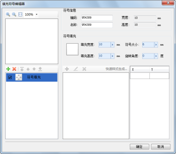

填充符号编辑器，可以通过填充符号选择器打开，具体如下。有关填充符号选择器的打开方式，请参见：[打开填充符号选择器](SymFillSelector1)。

* 在填充符号选择器中，选中任意一个填充符号，然后，单击“编辑”按钮，或者在该填充符号上双击鼠标左键，即可打开填充符号编辑器，此时，填充符号编辑器的左下方区域列出了该符号的所有子填充，用户可以通过修改子填充，以实现对选中的符号的编辑操作；
* 在填充符号选择器中，单击“新建”按钮，打开填充符号编辑器，此时，用户可以制作新的填充符号。 
  
    

