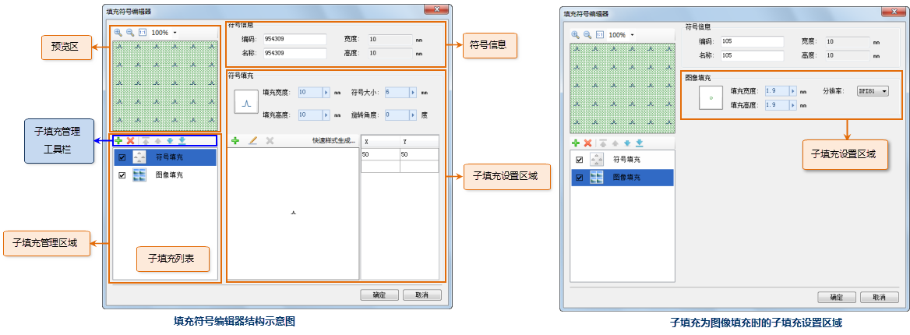
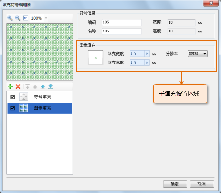
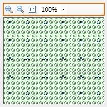

## 填充符号编辑器界面结构

下图展示了填充符号编辑器的界面布局：

* 符号信息：符号信息区域用来显示或设置填充符号的属性，包括：编码、名称、高度和宽度。
* 子填充管理区域：子填充管理区域由子填充管理工具栏和子填充列表构成，用来管理构成填充符号的子填充。填充符号由一个或多个子填充构成。子填充管理的主要操作有：添加、移除子填充，子填充的可见控制，设置子填充的类型，调整子填充的顺序等。
* 预览区域：预览区域实时展现了用户制作或编辑的填充符号应用于填充区域时的效果，并提供了按比例缩放的操作方式来预览符号应用效果。
* 子填充设置区域：用来设置子填充的风格。由于子填充有图像填充和符号填充两种类型，当子填充管理区域的子填充列表中选中的子填充类型不同时，相应的右侧子填充设置区域的显示内容有所不同。下图（左）展现了子填充列表中选中符号填充时的子填充设置区域，下图（右）展现了子填充列表中选中图像填充时的子填充设置区域。

下文介绍了填充符号编辑器一小部分功能的使用，关于填充符号编辑器其他功能的使用，将在帮助文档中的其他页面进行详细介绍，用户可以查阅帮助文档的其他部分。

 |   
---|---  
填充符号编辑器结构示意图 | 子填充为图像填充时的子填充设置区域  

## 预览区的浏览操作

在填充符号编辑器中的预览区域，预览窗口上方的工具栏提供了对填充符号应用效果进行缩放预览的工具，下面具体介绍各个功能按钮的使用。

  

填充符号预览区提供的缩放工具，能够按照预设的缩放比例，对填充符号应用于填充区域的效果进行缩放展示，预设的比例有：50%、75%、100%、200% 和 400% 五种。

* “放大”按钮，单击此按钮，可以放大显示预览窗口所显示的填充符号应用效果，每单击“放大”按钮一次，可以放大到当前比例的下一个较大预设比例，直到达到最高缩放比例值。
* “缩小”按钮，单击此按钮，可以缩小显示预览窗口所显示的填充符号应用效果，每单击“缩小”按钮一次，可以缩小到当前比例的下一个较小预设比例，直到达到最小缩放比例值。
* “1:1”按钮，单击此按钮，可以将当前预览区内的填充符号应用效果以1:1的比例显示。
* **显示比例下拉框** ：显示比例下拉框中当前显示的比例，即为当前填充符号应用效果缩放的比例。通过从显示比例下拉框中选择一个预设缩放比例，对当前填充符号应用效果进行缩放预览。此外，点击“放大”、“缩小”和“1:1”按钮，显示比例下拉框显示的缩放比例会自动变为操作后的缩放比例。

