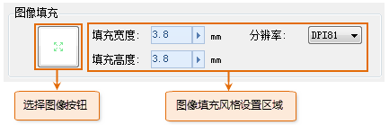
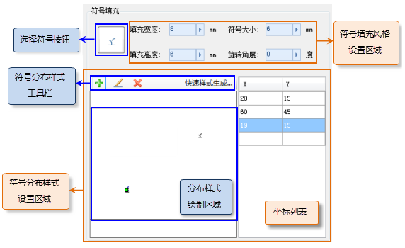
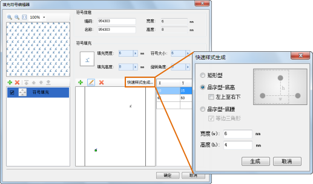

填充符号的子填充类型有两种：图像填充和符号填充。通过设置子填充的风格，可以构造出所需要的填充符号。

填充符号编辑器中子填充风格的设置内容，根据子填充类型而有所不同。下面具体介绍子填充风格设置，依据子填充的类型，下面分为图像填充和符号填充两种情况进行介绍。

## 图像填充风格设置

在填充符号编辑器中，当选中子填充列表中的某个图像填充，或者配合 Ctrl 键和 Shift
键选中多个图像填充时，填充符号编辑器右侧的子填充设置区域将相应地出现对应于图像填充风格设置内容，如下图所示，主要包括：选择图像、设置图像分辨率、图像填充宽度和高度等。

  

下面对图像填充风格设置的各个功能项分别进行介绍。

* **选择图像：** 指定图像填充子填充所使用的图像。单击按钮，弹出“导入图片”对话框，选择一幅图片作为填充图像；目前支持的图片文件格式有：*.png、*.jpg、*.jpeg 和 *.bmp。当图像填充设置了图像，“选择图像”按钮会显示所选图像的缩略图。 
* **填充宽度：** 设置图像填充的宽度。 
* **填充高度：** 设置图像填充的高度。 
* **分辨率：** 设置图像的分辨率。 

## 符号填充风格设置

在填充符号编辑器中，当选中子填充列表中的某个符号填充，或者配合 Ctrl 键和 Shift
键选中多个符号填充时，填充符号编辑器右侧的子填充设置区域将相应地出现对应于符号填充风格设置内容，如下图所示，主要包括：选择符号、前景色、背景色设置，填充宽度和高度设置，符号大小、旋转角度设置。

  

下面对符号填充风格设置的各个功能项分别进行介绍。

* **选择符号：** 指定符号填充子填充所使用的符号。单击按钮，弹出"选择符号"对话框，选择一个点符号作为填充符号；符号可以是矢量的或者栅格的。当符号填充设置了符号，"选择符号"按钮会显示所选符号的缩略图。 
* **填充宽度：** 设置符号填充的宽度。单位为：毫米（mm）。 
* **填充高度：** 设置符号填充的高度。单位为：毫米（mm）。 
* **符号大小：** 设置所选点符号的显示大小。单位为：毫米（mm）。 
* **旋转角度：** 设置所选点符号的旋转角度，输入值应为0 - 360度之间的数值。 
* **符号分布样式：** 符号分布样式是指，符号填充所使用的符号在填充单元中的散布样式，是通过在分布样式绘制区域添加一系列符号位置完成的。有关符号分布样式的详细介绍，参见[填充符号构成](SymFillEditor0)中相应部分内容。 

单击符号分布样式工具栏的添加按钮，鼠标变为图钉状态，此时，在分布样式绘制区域单击鼠标，或者在右侧坐标列表中直接输入X、Y坐标值，即可添加一个符号位置，同时，可以在填充符号编辑器的预览区域实时预览填充效果。

单击符号分布样式工具栏的修改按钮，再单击符号样式绘制区域中的符号，即可选中该符号，可以配合使用
Shift 键来选中多个符号，同时，坐标列表中相应的坐标条目也被选中；之后可以通过按住鼠标拖动或者在右侧坐标列表中修改来改变其位置。

当符号分布样式绘制区域中有一个或多个符号被选中时，符号分布样式工具栏的删除按钮呈可用状态，单击该按钮，可以删除选中的符号；还可以通过直接删除坐标列表中的坐标条目来删除对应的符号。

填充符号编辑器提供了快速样式生成功能。如下图所示，单击符号分布样式工具栏上的“快速样式生成”按钮，弹出“快速样式生成”对话框，可以设置符号的分布样式为：矩形型、品字型-底高、品字型-底腰。根据相应的要求来输入宽高值、底腰长等，可以方便地自动快速生成符号填充的符号分布样式。

  
