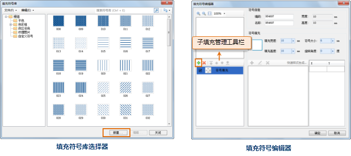
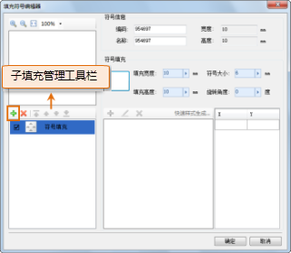
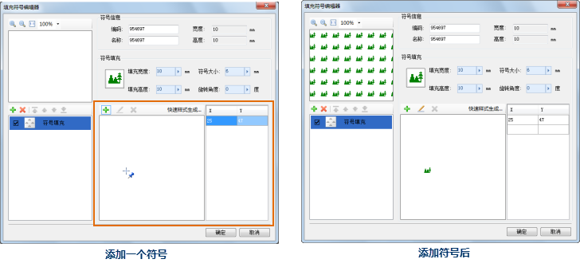
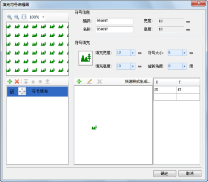

通过新建填充符号，可以扩充填充符号库中的填充符号资源。下面具体介绍如何完成新建填充符号的基本过程。

1. 在填充符号库选择器中，选中符号分组结构树中的某个符号分组，新建的符号默认添加到符号库选择器中当前显示的符号路径下，这里选中符号根组；
2. 在符号库选择器中，单击“新建”按钮，此时将打开填充符号编辑器，在填充符号编辑器中可以制作新的填充符号； 

这里，必须指定新符号编号、符号名称，同时，新的符号必须包含至少一个子填充，即新建的符号不能为空，这样，在单击填充符号编辑器中的“确定”按钮，才可以成功创建一个新的填充符号，新建的填充符号将出现在填充符号库选择器中的当前填充符号列表中。新建一个填充符号后，默认添加了一个符号填充类型的子填充。可以单击子填充管理工具栏中的“添加”按钮，添加新的子填充。

 |   
---|---  
填充符号库选择器 | 填充符号编辑器    

3. 设置新的填充符号的属性信息，必须指定的符号属性为：符号编号和符号名称； 
* 符号编号：符号编号用来在符号库中唯一标识该符号，在同一个符号库中，新建的符号编号不能同符号库中已有的符号的编号相同。新建填充符号后，会提供一个默认的符号编号值。
* 符号名称：符号在符号库中的显示名称，在同一个符号库中，符号的名称可以同名。  

  
---  
4. 在填充符号编辑器的右侧区域，单击如下图所示的按钮，弹出“选择符号”对话框，选中符号填充类型的填充符号所使用的作为填充元素的符号，然后单击“确定”按钮；   

  
  
  

5. 选择了作为填充符号填充元素的符号后，需要设置填充元素的布局模式，即设置符号在填充区域的散布模式，单击上图（“选择符号后”图）所示的添加按钮，鼠标移动到如下图（左图）所示的区域（此时鼠标状态变为下图所示的样子），在适当位置单击鼠标，在该区域添加一个填充元素，即符号，用户可以继续在适当位置单击鼠标，绘制其他填充元素，从而构建填充元素的分布模式，这里仅绘制一个符号，右键鼠标结束符号添加。 

添加符号后，如下（右图），同时在预览区域会展现所制作的填充符号的填充效果。

 |   
---|---  
添加一个符号 | 添加符号后    

6. 完成填充符号编辑后，单击填充符号编辑器上的“确认”按钮，所制作的填充符号将出现在当前填充符号选择器中的符号列表里。有关填充符号的进一步制作内容，请参见：[填充符号编辑器](SymFillEditor.htm) 中的相关内容。    
  
---  

新建的填充符号可以再次编辑，进一步完善填充符号，只需在填充符号库选择器中，选中该填充符号，然后单击“编辑”按钮，即可在填充符号编辑器中打开该填充符号，进行进一步的编辑操作。

在符号库中新建的填充符号，最终要保存到符号库中，还需要通过以下途径进行：

* 如果当前符号库是工作空间的资源集合中的填充符号库，可以通过保存该工作空间，将新建的符号保存到填充符号库中；
* 通过将填充符号库选择器中当前的填充符号库导出为填充符号库文件，可以将新建的填充符号保存到填充符