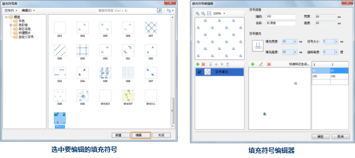

填充符号库选择器中所管理的填充符号可以进行进一步的编辑，从而满足新的需求。对填充符号库中的填充符号进行编辑时：

1. 首先，在填充符号库选择器中，选中要编辑的填充符号；
2. 然后，单击填充符号库选择器中的“编辑”按钮；或者在要编辑的填充符号上双击鼠标左键，即可打开的填充符号编辑器，同时，选中的填充符号的相关内容（如属性信息、子填充等）也出现在填充符号编辑器中，此时，就可以使用填充符号编辑器所提供的编辑功能，根据需要对填充符号进行进一步的编辑，编辑完成后，单击“确定”按钮即可。有关如何通过填充符号编辑器进行填充符号的编辑，请参见 [填充符号编辑器](SymFillEditor.htm) 使用指南部分。
3. 在编辑器中，完成填充符号的编辑操作后，单击“确定”按钮即可。  

 |   
---|---    
选中要编辑的填充符号| 填充符号编辑器  

对填充符号库中的填充符号的编辑结果，只有通过保存符号库文件或者通过保存符号库资源所在的工作空间，才能最终保存下来。

