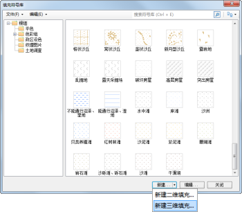

为了使场景中的面对象的填充风格更逼真，SuperMap
提供了三维填充符号编辑器，用来制作三维填充符号，目前，三维填充符号编辑器只能制作水面风格，并且填充风格为动态模式，可以逼真地表现水面。如下所示，为在三维符号编辑器中制作的水面填充符号。

  

### 如何制作三维填充符号

下面将详细介绍如何完成三维填充符号的制作，即完成水面的制作。

1. 打开三维填充符号编辑器：在填充符号库选择器中（如何打开填充符号库选择器，请参见：[打开填充符号库选择器](SymFillManager1)），单击“新建”下拉按钮，选择“新建三维填充...”。   
  
     

2. 在打开的三维填充符号编辑器中，对水面的风格进行设置和调整，主要包括：三维填充符号的属性、符号的快照、水面水波的状态设置等，此外，在三维填充符号编辑器中还可以对符号进行多角度的预览。
3. 设置符号属性：在“符号信息”区域，可以修改符号编号和符号名称。
4. 设置水波状态：水波大小，输入值范围为：0 至 1 之间，数值精度为：0.01；水波频率，输入数值范围为：0.2 至 100 之间，数值精度为：0.01；反射高度：输入值范围为：0.05 至 0.95 之间，数值精度为：0.01；水波方向，用来设置水流动的方向，水波方向通过 X轴和Y轴两个方向上的角度进行控制，两个方向的角度值范围都为 -100 至 100 之间。在设置水波方向时，处理可以输入数值，还可以使用数值框左侧的面板调整方向，如下图所示：  
  
    

5. 浏览三维填充符号：在左侧的区域中，可以对三维填充符号进行浏览，

这里提供了丰富的鼠标和键盘操作，从不同角度、不同方位对三维填充符号进行预览，有关预览操作，请参见：[三维线型符号编辑器界面简介](SymLine3DEditor2)
中的 **“预览区的浏览操作”** 内容。

在三维填充符号的预览区域的空间上有三个坐标轴，红色轴为 X 方向，绿色轴为 Y 方向，蓝色轴为 Z 方向。

为了方便预览所制作的水面填充风格应用到场景中的效果，预览区的场景中还提供了参照物，可以辅助用户判断所设置的参数是否符合实际应用需求。通过预览区顶部的“隐藏景观模型”/“显示景观模型”按钮，可以控制场景中的参照物景观是否显示。

6. 设置快照：在预览区调整好三维填充符号的效果后，可以单击“设置快照”按钮将其保存为快照，这样在填充符号库管理中所显示的该三维填充符号将以所保存的快照进行显示。如果对当前所设置的快照不满意，可以单击“清除快照”按钮，重新设置快照。
7. 以上设置完成后，单击“三维填充符号编辑器”上的“确定”按钮，即可完成符号的制作，此时，在填充符号库管理其中可以看到这个新建的三维填充符号。   
  
     

### 在场景中应用三维填充符号

如何将所制作的三维填充符号应用到场景中，其与将二维填充符号应用到场景中的面图层一样，三维填充符号也是对场景中的面图层进行符号化，只是在设置填充风格时所选择的填充符号不是二维填充符号而是三维填充符号。必须注意的是：被三维填充符号符号化的面图层，其高度模式必须设置为非贴地模式的状态，否则设置无效。如下图所示，左侧为场景中为面图层设置了普通二维填充风格的效果，右侧为场景中为面图层设置了三维填充风格（水面风格）的效果。

  
 

### 备注

三维水面填充符号被编辑后，已有的引用到该符号的图层需要刷新才能在场景中看到编辑之后的效果。

