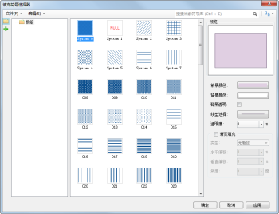

为了方便用户对填充符号的管理、制作和编辑，
提供了填充符号相关的管理器，通过与该界面的交互即可完成填充符号的管理、制作和编辑。同时可对面对象进行风格设置，在填充符号选择器中可以设置面对象的填充风格样式、填充颜色，设置面对象边界的线型风格以及其他填充效果，并且用户在填充符号选择器中所做的风格设置都将通过对应的图层风格体现。

  

  
下面的内容主要介绍如何使用填充符号选择器。

### 如何使用填充符号选择器

下面的表格是将填充符号选择器所提供的功能进行分类，每一部分包含了填充符号选择器的若干项功能点。用户可以使用下面的表格定位所需要了解的功能的使用方法。

功能分类 | 包含的功能点简介  
---|---  
[打开填充符号选择器](SymFillSelector1.htm) | 打开填充符号选择器。  
[填充符号选择器界面简介](SymFillSelector2.htm) | 填充符号选择器的界面结构，介绍各部分的作用和使用方式。  
[设置填充符号风格](SymFillSelector3.htm) | 使用填充符号选择器设置填充符号风格。  
[加载更多符号库](SymMarkerSelector4.htm) |在符号选择器中加载更多符号库文件对应的符号库进行符号应用。请参见点符号选择器中有关“[加载更多符号库](SymMarkerSelector4.htm)”的描述。  
**符号库分组结构管理** |对填充符号库的符号分组管理，如：新建/移除符号分组，改变符号所在的符号分组，复制/粘贴符号和符号分组，请参见：[符号库分组结构管理](SymMarkerManager3.htm)。  
[导入导出填充符号库文件](SymFillManager3.htm) | 打开填充符号库文件；  加载默认填充符号库；    导入填充符号库文件； 将当前填充符号库导出为填充符号库文件；  导出指定填充符号分组中的填充符号到填充符号库文件。  
[导入导出填充符号](SymFillManager4.htm) |将其他填充符号库文件中的符号导入到当前填充符号库中； 将指定的填充符号导出为图片。  
[新建填充符号](SymFillManager5.htm) |新建一个二维填充符号，简单制作一个二维填充符号，并添加到当前填充符号库中。  
[新建三维填充符号](SymFillManager8.htm) |新建一个三维填充符号，制作一个三维填充符号，并添加到当前填充符号库中，然后，将该三维填充符号应用到场景中。  
[编辑填充符号](SymFillManager6.htm) | 编辑填充符号库中的某个填充符号。  
[保存工作成果](SymFillManager7.htm) | 通过填充符号库文件保存工作成果；   通过工作空间保存工作成果。  
  
