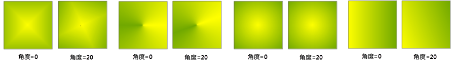

通过填充符号选择器中的符号风格设置区，可以对填充符号进行风格设置，包括填充区域的填充风格以及填充区域边界的线型风格。

  

## 填充区域边界的线型风格设置

设置填充区域边界的线型风格，与设置线对象的线型风格的方式相同。在符号风格设置区域，单击“线型选择”右侧的按钮，弹出“线型符号选择器”，在线型符号选择器中，设置线型风格，设置完成后，单击“确定”按钮，即可将所设置的线型风格应用于填充区域的边界。

关于在线型符号选择器中设置线型风格，请参见：[设置线型符号风格](SymLineSelector3.html) 。

## 填充区域的填充风格设置

关于填充区域的填充风格，其设置可以分为两种情况：

* 无渐变填充：在不使用渐变填充方式时，可以使用填充符号列表中的任意一种填充符号作为填充区域的填充风格，此时，符号风格设置区域的设置都将应用于所选择的填充符号。
* 渐变填充：当选择了渐变填充作为填充区域的填充风格时，将不能使用填充符号列表中的任意一种填充符号作为填充区域的填充风格，而只能通过颜色渐变的方式作为填充区域的填充风格。

根据上述的两种情况，下面分别介绍如何设置填充风格以及符号风格设置区域中各个项目的作用和使用方式。

## 1\. 无渐变填充

在符号风格设置区域中，当“渐变填充”复选框没有被勾选时，或者“渐变填充”复选框被勾选，但是渐变类型为无渐变时，填充区域的填充模式为无渐变填充。无渐变填充可以使用填充符号列表中的任意一个填充符号作为填充样式。

首先，在填充符号列表中选择一个填充符号，作为填充的样式，其后，在符号风格设置区域所做的风格设置都将应用于该填充符号。如下图所示，选择一个填充符号，以该填充符号为例说明填充风格的设置。

  
 
* **设置填充符号颜色：**

填充符号的颜色由两部分组成，前景颜色和背景颜色。其中，前景颜色：是指构成填充符号的几何对象的颜色；背景颜色：是指除了构成填充符号的几何对象之外的填充符号其他部分的颜色，填充符号的背景可以理解为用来绘制填充符号中的几何对象的画布，背景颜色即为画布的颜色。

符号风格设置区域中，“前景颜色”右侧的颜色按钮，用来设置填充符号的前景颜色，单击该颜色按钮，弹出颜色面板，可以选择或设置需要的颜色。

符号风格设置区域中，“背景颜色”右侧的颜色按钮，用来设置填充符号的背景颜色，单击该颜色按钮，弹出颜色面板，可以选择或设置需要的颜色。该项只有在“背景透明”复选框没有被勾选时才有效。

“背景透明”复选框如果被勾选，填充符号的背景将被透明化，填充符号的背景颜色设置无效。

  
  
* **设置填充符号透明度：**

在填充符号风格设置区域中，可以通过“透明度”项设置填充符号的透明效果。透明度的数值为 0 至 100 之间的任意整数，0 表示完全不透明；100
表示完全透明。设置透明度数值时，既可以在数值框中直接输入数值；也可以单击数值框右侧的箭头弹出滑块，通过调节滑块的位置，或者单击放大或缩小按钮的方式，设置数值。

## 2\. 渐变填充

在符号风格设置区域中，当“渐变填充”复选框被勾选，并且渐变类型为非“无渐变”时，填充区域的填充风格为渐变填充。渐变填充是通过颜色的渐变方式作为填充风格，此时，在填充符号列表中选择任意一种填充符号时，都无法将其作为填充风格样式，即填充符号的填充风格无效。

填充区域的颜色渐变填充，是通过两种颜色构成的颜色渐变，即从一种颜色（起始色）渐变到另一种颜色（终止色）。

* **设置渐变颜色：**

符号风格设置区域中，“前景颜色”右侧的颜色按钮，用来设置渐变颜色的起始色，单击该颜色按钮，弹出颜色面板，可以选择或设置需要的颜色。

符号风格设置区域中，“背景颜色”右侧的颜色按钮，用来设置渐变颜色的终止色，单击该颜色按钮，弹出颜色面板，可以选择或设置需要的颜色。该项只有在“背景透明”复选框没有被勾选时才有效。

“背景透明”复选框如果被勾选，渐变颜色的终止色为透明色，即无色。

* **设置渐变填充类型：**

符号风格设置区域中，渐变填充区域中的“类型”右侧的下拉按钮，用来设置渐变模式，该下拉列表中提供了四种渐变模式：线性、辐射、圆锥、方形，这四种渐变填充模式的填充效果及说明如下所示。下面的渐变填充模式示意图中，渐变填充的中心点与填充范围中心点重合，即水平偏移和垂直偏移量为0，填充范围为规则的矩形范围，并且渐变填充的角度参数值也为0。  

方形渐变  
以渐变填充的中心点为起始点，从起始色渐变到终止色，其以起始点为中心的正方形的颜色随着边长的增大从起始色均匀渐变到终止色。
  
  

圆锥渐变

从起始母线到终止母线，渐变在逆时针和顺时针两个方向发生渐变，都是从起始色渐变到终止色。起始母线和终止母线的交角点（圆锥的顶点）为渐变填充的中心点，起始母线和终止母线在一条水平线上，其交角为180度。
  
  

辐射渐变

以渐变填充的中心点起始点，从起始色渐变到终止色，其以起始点为圆心的各个圆的颜色随着圆的半径的增大从起始色均匀渐变到终止色。在同一个圆周上颜色不发生变化，不同的圆之间颜色发生渐变。
  

线性渐变

从水平线段的起始点到终止点，其颜色从起始色均匀渐变到终止色，垂直于该线段的直线上颜色不发生渐变。    
  

* **设置渐变参数：**

水平偏移：用来设置渐变填充中心点相对于填充范围中心点的水平偏移百分比。设置水平偏移数值时，既可以在数值框中直接输入数值；也可以单击数值框右侧的箭头弹出滑块，通过调节滑块的位置，或者单击放大或缩小按钮的方式，设置数值。

垂直偏移：用来设置渐变填充中心点相对于填充区域范围中心点的垂直偏移百分比。设置垂直偏移数值时，既可以在数值框中直接输入数值；也可以单击数值框右侧的箭头弹出滑块，通过调节滑块的位置，或者单击放大或缩小按钮的方式，设置数值。

角度：用来设置渐变填充的颜色渐变方向，该参数值主要影响线性渐变、方形渐变和圆锥渐变，而对辐射渐变没有影响。设置角度数值时，既可以在数值框中直接输入数值；也可以单击数值框右侧的箭头弹出滑块，通过调节滑块的位置，或者单击放大或缩小按钮的方式，设置数值。如下图所示，将角度设置为20度后，与0度的对比效果。

* **设置填充符号透明度：**

在填充符号风格设置区域中，可以通过“透明度”项设置填充符号的透明效果。透明度的数值为 0 至 100 之间的任意整数，0 表示完全不透明；100
表示完全透明。设置透明度数值时，既可以在数值框中直接输入数值；也可以单击数值框右侧的箭头弹出滑块，通过调节滑块的位置，或者单击放大或缩小按钮的方式，设置数值。

