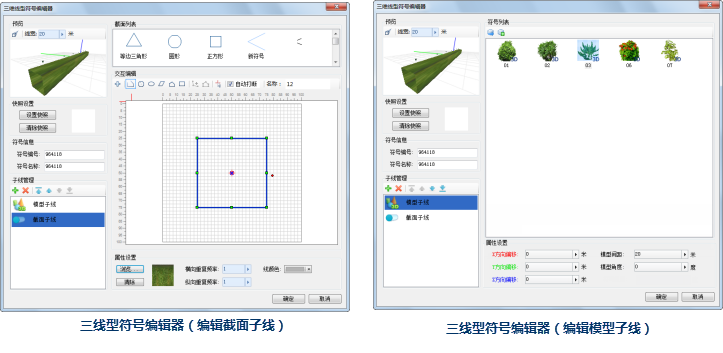

## 三维线型符号编辑器

三维线型符号编辑器，提供了制作新的三维线型符号或者编辑已有的三维线型符号的场所，在三维线型符号编辑器中，用户通过界面交互的方式即可方便、快速、准确地完成三维线型符号的编辑。在三维线型符号编辑器中，可以通过绘制截面的方式快速构建三维线型符号；也可以通过三维模型的虚实组合构建由三维模型构成的线型。

 
  
## 如何使用三维线型符号编辑器

下面的表格是将三线型符号编辑器所提供的功能进行分类，每一部分包含了线型符号编辑器的若干项功能点。用户可以使用下面的表格定位所需要了解的功能的使用方法。

功能分类 | 包含的功能点简介  
---|---  
[三维线型符号构成](SymLine3DEditor0) |在三线型符号编辑器中，是通过子线来构成三线型符号的，三维线型符号的子线分为截面子线和模型子线两种类型。这里主要介绍构成三维线型符号的子线。  
[打开三维线型符号编辑器](SymLine3DEditor1) | 打开三维线型符号编辑器。  
[三维线型符号编辑器界面简介](SymLine3DEditor2) | 三维线型符号编辑器的界面结构介绍。  在三维线型符号编辑器的预览区域，预览所制作的三维线型符号。  
[制作模型子线](SymLine3DEditor3) | 如何制作构成三维线型符号的模型子线。  
[制作截面子线](SymLine3DEditor4) | 如何制作构成三维线型符号的截面子线。  
[保存符号编辑成果](SymLine3DEditor5) | 保存符号编辑成果。  
  
