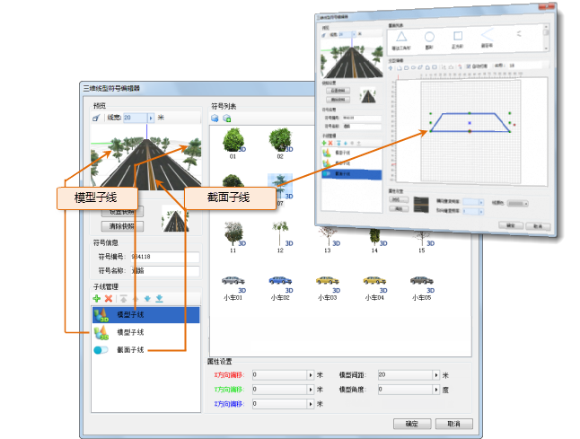
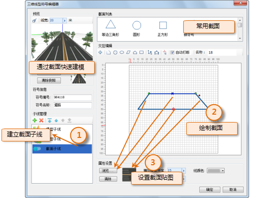
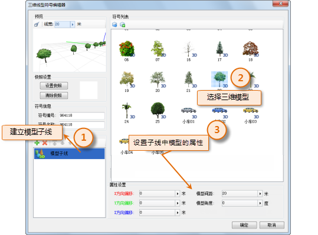

在三维线型符号编辑器中制作三维线型符号，三维线型符号都是由若干子线构成，通过子线的不同形式和风格样式来构建所需要的三维线型符号，因此，构成三维线型符号的基本元素是子线。构成三维线型符号的子线有两种类型：截面子线和模型子线。

如下图所示，制作某个三维线型符号，其由三个子线构成：子线1（截面子线）和子线2、子线3（模型子线）。

  

  
## 截面子线

截面子线，是通过绘制三维线的横截面，通过横截面快速构建三维线，所构建的截面子线可以进行纹理贴图，并可以对不同侧面进行不同的纹理贴图；也可以通过设置颜色的方式为子线的各个侧面设置纯色填充。

  

  
## 模型子线

模型子线，是由三维模型构成的子线，通过设置模型子线的属性，控制三维模型在线性方向上分布、排列形式（也就是在线性方向上每隔多少距离绘制一个给定的三维模型）以及三维模型的旋转角度，从而构造符合要求的模型子线。

  
