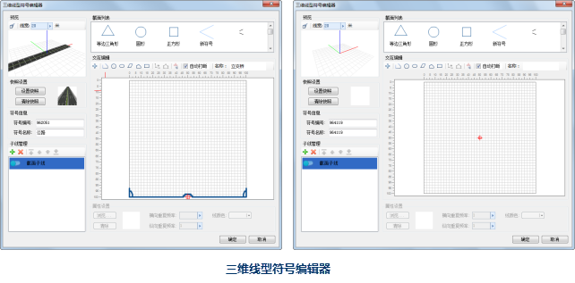

三维线型符号编辑器，可以通过线型符号选择器打开，具体如下。有关线型符号选择器的打开方式，请参见：[打开线型符号选择器](SymLineSelector1)。

* 在线型符号选择器中，选中任意一个三维线型符号，然后，单击“编辑”按钮，或者在该三维线型符号上双击鼠标，即可打开三维线型符号编辑器，三维线型符号编辑器的左下方区域显示的是选中的三维线型符号的子线列表，用户可以分别对各个子线进行修改，以实现对选中的符号的编辑操作；
* 在线型符号选择器中，单击“新建”下拉按钮右侧的小三角，在弹出的下拉菜单中单击“新建三维线型”，即可打开三维线型符号编辑器。

  

