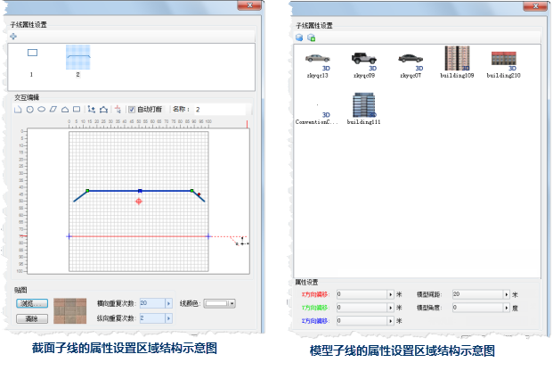

## 三维线型符号编辑器界面结构

### 三维线型符号编辑器界面的基本结构

下图展示了三维线型符号编辑器的界面布局：

* 符号属性：符号属性区域用来设置或修改三维线型符号的属性，包括：符号编号、符号名称。 
* 子线管理区域：子线管理区域用来管理构成三维线型符号的子线。子线管理包括：添加、删除子线，移动子线的层次，设置子线的类型等。 
* 预览区域：实时展现用户所制作和编辑的三维线型符号的结果，预览区提供了基本的预览操作，可以满足用户的多种预览要求。 
* 快照设置：快照即为当前三维线型的制作成果进行一次“照相”，保存为一幅图片，将三维符号应用于二维地图上时使用此图片进行符号化。用户可以设置当前制作的三维线型的快照、清除快照。 
* 子线属性设置区域：用于设置子线的相关属性。通过设置子线的各项属性，来制作不同风格的三维线型符号。子线可以设置的属性根据子线的类型而有所不同，较为详细的介绍请参见本页面“子线属性设置区域的结构”部分的介绍。 
  

### 子线属性设置区域的结构

1. **截面子线的属性设置区域的结构**

下图（左）展示了截面子线的属性设置区域的构成。截面子线的属性设置区域的功能区域划分如下：

  * 交互编辑区域：交互编辑区域是绘制截面子线的截面的绘图区域。交互编辑区域提供了多种几何图形的绘制和编辑工具、刻度尺以及背景格网。
  * 最近使用截面列表区域：提供最近制作三维线型符号所使用的截面列表，以及导入符号的功能，方便用户快速构造所需截面，减少重复工作。
  * 贴图设置区域：提供了设置截面的线颜色、贴图使用的图片及贴图重复次数等功能。
2. **模型子线的属性设置区域的结构**

下图（右）展示了模型子线的属性设置区域的构成。模型子线的属性设置区域的功能区域划分如下：

  * 最近使用模型列表区域：提供了最近制作三维线型符号所使用的模型列表，其中包括用户导入的三维点符号或模型。用户可以选择列表中的模型作为当前模型子线所使用的模型。
  * 模型子线虚实模式设置区域：用来设置模型子线的虚实模式，获得更为丰富的模型子线类型。有关模型子线虚实模式的描述，请参见：[制作模型子线](SymLine3DEditor3.htm)中的"设置模型子线虚实模式"内容。
  * 模型偏移和角度设置区域：用来设置模型在 X、Y、Z 方向的偏移量和模型的旋转角度。  

|  
---|---  
截面子线的属性设置区域结构示意图|模型子线的属性设置区域结构示意图  

## 预览区的浏览操作

在三维线型符号编辑器中，当前制作或编辑的三维线型符号的在空间上（由 X、Y、Z 三轴构成）的效果，将实时展现在预览区的预览窗口中，如下图所示，用户可以通过
**鼠标** 方式来变换视角，实现对三维线型效果的预览。下面具体其介绍操作方式。

  

1. 鼠标操作方式： 
  * 按住鼠标左键拖动：实现对三维线型预览的平移。 
  * 滑动鼠标滚轮：实现对三维线型预览的拉近和推远，即放大和缩小。 
  * 按住鼠标滚轮拖动：改变三维线型预览的俯仰角。 
  * 按住鼠标右键拖动：实现对三维线型预览的拉近和推远，即放大和缩小。 
  * ""：将预览窗口中的三维线型预览恢复到默认视点。 

以上几种浏览三维线型效果的鼠标操作方式搭配使用，能够实现对三维线型效果的多角度多方位的预览，方便用户对三维线型进行调整。
