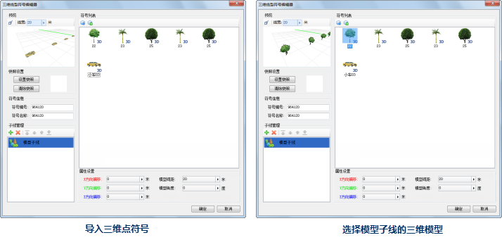
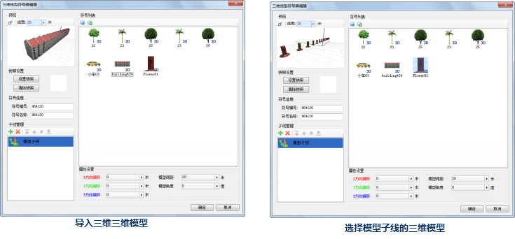

制作的模型子线主要包括以下几个步骤：

1. 新建模型子线；
2. 选择构成模型子线的三维模型；
3. 设置模型子线中模型的属性，包括模型的间隔以及旋转角度；
4. 设置模型子线的偏移。

## 新建模型子线

打开三维线型符号编辑后，在子线管理列表中默认新建了一个子线，该子线的类型为截面子线，此时，在子线上双击鼠标，该子线变为如下（中间图）所示的样子，即变为下拉列表框，单击侧的下拉按钮，弹出子线类型列表，选择模型子线，即可完成模型子线的新建。

  

另外，也可以通过如下方式添加一个新的模型子线：

1. 单击子线管理工具栏上的“添加”按钮，添加一个子线；
2. 双击新添加的子线，双击后，该子线变为下拉列表框，单击右侧的下拉按钮，弹出子线类型列表，模型子线。

## 选择构成模型子线的三维模型

可以通过两种方式获取构成模型子线的三维模型：一是，通过选择保存在点符号库中某个三维点符号，将该三维点符号作为构成子线的三维模型；二是，通过导入一个三维模型文件（*.sgm 或 *.3ds），将三维模型文件中的三维模型作为构成子线的三维模型。

下面具体介绍如何通过两种方式选择构成模型子线的三维模型。

### 导入三维点符号

1. 单击“导入三维符号”按钮，如下图所示，弹出“导入点符号”对话框；    
  

2. 在“导入点符号”对话框中选择要导入的三维点符号所在的点符号库文件，并打开；   
   

3. 弹出“选择符号”对话框，该对话框以符号选择器的方式显示所打开的点符号库文件对应的符号库，在符号列表中选中要导入的三维点符号； 

由于“选择符号”对话框以符号选择器的方式显示该符号库文件对应的符号库，因此，在“选择符号”对话框可以进行与符号选择器类似的符号库管理操作，这里用户可以通过“选择符号”对话框中的“文件”菜单下的功能打开其他点符号库文件，从而选择要导入的三维点符号。

  

4. 导入三维点符号后，如下图所示，三维点符号会出现在模型列表中，在列表中选择构成当前模型子线的三维模型，此时，在预览区域中就会显示模型子线的效果。  

 |   
---|---  
导入三维点符号 | 选择模型子线的三维模型  

### 导入三维模型

1. 单击“导入三维模型”按钮，如下图所示，弹出“打开”对话框；   
   
---  
2. 在“打开”对话框中选择要导入的三维模型（*.sgm 或 *.3ds 文件），并打开；  
   
---  
3. 导入三维点模型后，如下图所示，三维模型会出现在模型列表中，在列表中选择构成当前模型子线的三维模型，此时，在预览区域中就会显示模型子线的效果。  

 |  
---|---  
导入三维三维模型 | 选择模型子线的三维模型  

此外，还可以通过“子线属性设置”区域中的“符号角度”属性，设置模型子线中模型的旋转角度。在设置数值时，既可以直接在“符号角度”数值框中输入数值；也可以单击右侧的箭头弹出滑块，通过调节滑块的位置，或者单击放大或缩小按钮的方式，设置数值。

## 设置模型子线中模型的属性

模型子线的“模型间距”用来控制构成模型子线的三维模型在线性方向上每隔多少距离出现一个三维模型。

模型子线的“模型角度”用来控制构成模型子线的三维模型在水平方向上的旋转角度。

  

## 设置模型子线偏移

在“子线属性设置”区域中的“X方向偏移”、“Y方向偏移”、“Z方向偏移”分别用来设置模型子线沿着坐标轴
X、Y、Z方向的偏移量，偏移数值的单位为：米。在设置数值时，既可以直接在数值框中输入数值；也可以单击右侧的箭头弹出滑块，通过调节滑块的位置，或者单击放大或缩小按钮的方式，设置数值。

在三维线型符号编辑器的预览区域中，显示了三维空间的坐标轴，并以三种颜色区分三个方向的坐标轴，同时，“子线属性设置”区域中的“X方向偏移”、“Y方向偏移”、“Z方向偏移”的属性也对应地采用相应颜色的字体，从而形象地区分三个坐标方向的偏移效果。如下图所示，红色的坐标轴为
X 轴，绿色坐标轴为 Y 轴，蓝色坐标轴为 Z 轴。

  
