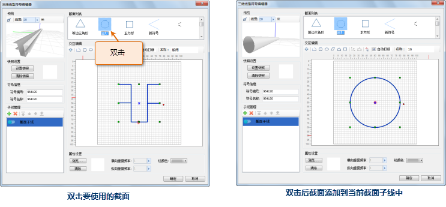

制作截面子线主要包括以下几个步骤：

1. 新建截面子线；
2. 构建截面子线的截面；
3. 调整截面子线的位置；
4. 设置截面的颜色或贴图。

## 新建截面子线

如下图所示，打开三维线型符号编辑后，在子线管理列表中已经默认新建了一个子线，该子线的类型即为截面子线；用户还可以单击子线管理工具栏上的""按钮，来添加一个子线，新添加的子线的类型均预设为截面子线类型；如果要把模型子线更改为截面子线，可以双击该模型子线，在弹出的下拉列表中选择“截面子线”，即可完成更改。

  
---  
打开三维线型符号编辑器后默认状态  

## 构建截面子线的截面

构建截面子线的截面，可以通过以下三种方式来完成：

1. 绘制截面：在交互编辑区域的绘制区域绘制截面；
2. 导入二维矢量点符号：导入二维矢量点符号作为当前截面子线所使用的截面；
3. 选择最近使用的截面：从最近使用截面列表中选取。

### 绘制截面

在三维线型符号编辑器的交互编辑区域，如下图所示，交互编辑工具条提供了一系列截面绘制和编辑工具，使用这些工具，可以方便、快速地绘制所需的截面。下面进行进一步介绍。

* **图形绘制工具：** 基本的图形绘制工具，用来绘制截面。具体使用方法与点符号编辑器中的对应的笔划绘制工具的使用方法相同，请参见 [点符号笔划绘制](SymMarkerEditor6.htm) 中“如何使用工具栏中的按钮绘制笔划”部分内容。
* **添加节点、编辑节点：** 为绘制的截面图形添加节点、移动或删除节点。具体操作方式为： 
1. 添加节点：选中要添加节点的图形（注意只能选中一个图形对其进行添加节点操作），单击“添加节点”按钮，此时，选中的图形显示出其所有节点，在图形上目标位置单击鼠标，即可在相应位置添加节点。 
2. 编辑节点：移动或删除截面图形的一个或多个节点。选中要进行操作的图形，单击“编辑节点”按钮，此时，选中的图形将显示其所有节点，选中某个节点，按住鼠标左键不放，移动鼠标，可以移动该节点；选中某个节点，或配合 Ctrl 键和 Shift 键选中多个节点，按 Delete 键，可以删除选中的节点。
* **设置原点：** 编辑区域上的“”（原点），为X 、Y、Z 三轴的交点，在空间上位于地表上。改变原点的位置，预览窗体上能够实时观察到截面对应的三维线，相对于 X、Y、Z 轴交点位置的关系变化。单击编辑区域上方的“”（设置原点）按钮，然后，在编辑区域要设置为原点的目标位置单击，即可改变原点位置。
* **自动打断：** 选中“自动打断”单选框后，绘制的图形将在其节点处自动打断，注意“圆”和“椭圆”除外；不选中该单选框，则绘制的图形的节点不被打断，保持为一个图形。
* **设置截面名称：** 在“名称：”后的文本框中输入或修改截面的名称，在最近使用截面列表中，该截面下方相应地显示设置的名称，可以用来区分不同截面。
  
---  
截面子线交互编辑工具条  

### 导入二维矢量点符号

1. 单击最近使用截面列表区域上方的“添加”按钮（），如下图所示，将弹出“选中符号”对话框；    
---  
点击“添加”按钮  
2. 弹出的"选择符号"对话框，以符号选择器的方式显示当前工作空间对应的符号库，在符号列表中选中要导入的二维矢量点符号，点击“确定”按钮，即可将当前选中符号添加到三维线型编辑器的当前截面子线中。

由于"选择符号"对话框以符号选择器的方式显示该符号库文件对应的符号库，因此，在"选择符号"对话框可以进行与符号选择器类似的符号库管理操作，这里用户可以通过"选择符号"对话框中的"文件"菜单下的功能打开其他点符号库文件，从而选择要导入的二维矢量点符号。

3. 导入二维矢量点符号后，如下图所示，该二维矢量点符号出现在最近使用截面列表中，并自动添加到当前截面子线中。注意，导入二维矢量点符号后，将读取点符号的锚点位置作为编辑区域的原点位置。    
---  
选择的符号添加到当前截面  

### 选择最近使用的截面

三维线型编辑器的右上方的最近使用截面列表中，列出了当前工作空间中三维线型符号所使用的截面，以及制作当前符号所使用过的截面，即每绘制或者导入一个截面，都会将对应的截面添加到最近使用截面列表中。

在常用截面列表中，双击列表中某个截面图形，即可在截面绘制区域添加选中的截面。如果在添加选中的截面前，当前截面绘制区域已经存在截面图形，将弹出提示框，提示用户是否保留截面绘制区域已经存在的截面图形，单击对话框中的“是”按钮，保留原有截面图形同时添加新的选中的截面图形；单击“否”按钮，清除截面绘制区域已有的截面，然后添加选中的截面图形。

 |   
---|---  
双击要使用的截面 | 双击后截面添加到当前截面子线中  

## 调整截面子线的位置

编辑区域与预览窗体中坐标系统的对应关系如下图所示：

原点对应 X、Y、Z 三轴的交点，X、Y 轴所形成的平面在空间上对应地平面，Z 轴垂直于地平面；编辑区域的水平方向，对应于 X
轴方向，即当截面位于原点的左侧时，对应的三维线位于 X 轴左侧；编辑区域的竖直方向，对应于 Z 轴方向，即当截面位于原点的上方时，对应的三维线位于 X、Y轴形成的平面的上方。

  

了解了编辑区域与预览区域的空间对应关系后，可以更快地根据需求调整截面的位置。

调整截面位置的方法是： 拉框选中整个截面，按住鼠标左键不放，移动鼠标，在目标位置松开鼠标，即可将截面移动到相应位置；也可以选中截面的部分线，来调整其位置。

## 设置截面的颜色或贴图

### 设置截面颜色

选中截面，或者截面的一条或多条线，单击“线颜色”下拉框右侧的小三角，在弹出的颜色列表中选择一种颜色，即可设置选中的截面的颜色。如下图所示：从预览窗体中可以看出，应用颜色到三维线型上，具有阴影效果。

  

### 设置截面贴图

1. 选中截面，或者截面的一条或多条线； 
2. 在贴图设置区域单击“浏览”按钮，弹出“选择图片”对话框，选中用来贴图的图片，点击“确定”按钮； 
3. 设置图片的重复次数。图片的重复次数，即为图片三维线的表面重复放置的次数，分为“横向重复”（对应 X 轴方向）和“纵向重复”（对应 Y 轴方向）两种。 

**注意** ：若设置的贴图为 *.gif 格式，则要求图片大小在512*512以下，帧数小于60帧，才可保证图片的完整显示。

  

