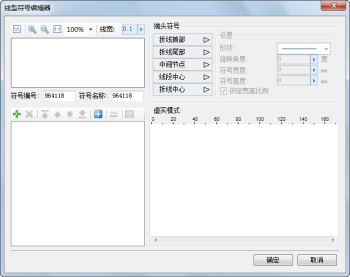

## 线型符号编辑器

线型符号编辑器，提供了制作新的二维线型符号或者编辑已有的二维线型符号的场所，在线型符号编辑器中，用户通过界面交互的方式即可方便、快速、准确地完成二维线型符号的编辑。

  
---  
线型符号编辑器  
  
## 如何使用线型符号编辑器

下面的表格是将线型符号编辑器所提供的功能进行分类，每一部分包含了线型符号编辑器的若干项功能点。用户可以使用下面的表格定位所需要了解的功能的使用方法。

功能分类 | 包含的功能点简介  
---|---  
[二维线型符号构成](SymLineEditor0.htm) |在线型符号编辑器中，是通过子线来构成线型符号的，并且子线可以进行虚实模式的设置、子线线型设置、子线偏移的设置，从而通过子线组合成最终需要的线型符号。这里主要介绍子线如何构成线型符号，以辅助线型符号的制作和编辑。  
[打开线型符号编辑器](SymLineEditor1.htm) | 打开线型符号编辑器。  
[线型符号编辑器界面简介](SymLineEditor2.htm) | 线型符号编辑器的界面结构介绍。在线型符号编辑器的预览区域，预览所制作的线型符号。  
[线型符号子线管理](SymLineEditor3.htm) |管理线型符号中的子线，包括：删除子线、添加子线、设置子线类型、设置子线的风格、移动子线叠加顺序等操作。  
[设置子线虚实模式](SymLineEditor4.htm) | 对子线的虚实模式进行设置，同时，例举不同子线类型下的虚实模式的不用作用效果。  
[添加端头符号](SymLineEditor5.htm) | 为制作的线型符号添加端头符号，以及对端头符号的风格进行进一步设置。  
[设置子线的风格](SymLineEditor6.htm) | 设置子线的风格，如：子线的颜色、线宽、端头样式、连接样式等。  
[保存符号编辑成果](SymLineEditor7.htm) | 保存符号编辑成果。  
  
