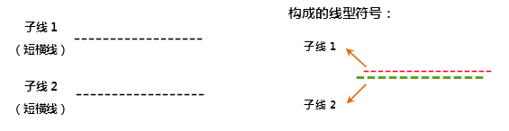
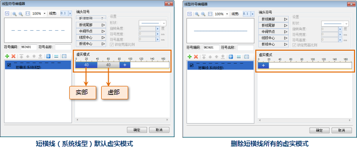

在线型符号编辑器中制作线型符号，线型符号都是由若干子线构成，通过子线的不同形式和风格样式来构建所需要的线型符号，因此，构成线型符号的基本元素是子线。例如，下图所示，展示了子线构成线型的基本方式。

如下图所示，制作某个线型符号，其由两个子线构成：子线1和子线2，两个子线都为短横线类型，根据所制作的线型符号的要求，对子线进行适当的横向偏移和纵向偏移，并设置子线的颜色风格和线宽，即可完成该线型符号的制作。线型符号编辑器中提供了类型多样的子线，用户可以基于这些子线，通过修改子线的风格和样式，构建所需要的线型符号。

|构成方式：对子线1横向偏移2毫米，纵向偏移2毫米，固定子线1的颜色为：红色 RGB(255 ,0,0)；对子线2固定子线颜色为：绿色RGB(0,255,0)，设置线宽为1毫米。|   
---|---|---  

## 子线类型

线型符号编辑器中制作线型符号，都将基于子线构建，并且编辑器中已经提供了多种子线的类型，如下图所示，在线型符号编辑器中添加了一个子线后，即可选择该子线的类型，图中下拉列表中的子线型为所提供的基础子线类型。

 |   
---|---  
子线类型列表 | 自定义由符号构成的子线  

此外，子线还可以由特定的符号构成，如下图所示，子线的类型为符号子线，即由符号构成的子线，通过子线的虚实模式（有关子线的虚实模式，参见下文虚实模式内容）可以调整子线中的符号如何分布，如符号间的间隔等。设置子线的类型为符号子线，需要选择子线类型列表中的“自定义符号”，如上面（右图）所示。

设置了子线的类型为符号子线时，就可以进一步指定构成子线的符号，以及调整子线的虚实模式。

  

选择符号（一词单击图中标识的按钮，可以打开“选择符号”对话框，选择构成子线的符号）  
  
设置符号子线的虚实模式（对比两种虚实模式设置）  

## 子线虚实模式

子线的虚实模式，用来确定在一条子线上，哪段距离绘制内容，哪段距离不进行绘制，从而制作类似于短横线类型的子线，如下（左图）所示，短横线类型的子线（系统线型），其虚实模式的设置如图中圈定的内容，蓝色颜色块表示实部的距离，距离值为颜色块上的数字所示；灰色颜色块表示虚部的距离，距离值为颜色块上的数字所示。

如下（右图）所示，为取消短横线类型子线的所有虚实模式的设置结果，子线成为一条实线。

 |   
---|---  
短横线（系统线型）默认虚实模式 | 删除短横线所有的虚实模式  

虚实模式是如何作用于子线，影响子线的绘制效果？下面的内容将进行详细解释，由于子线有不同的类型，对于同样的虚实模式，一些类型的子线可能会产生虚实模式的不同解读方法。主要有以下几类方式，来解释虚实模式对子线产生的作用效果。

### 短横线类型：

如果添加子线后，设置子线类型为短横线（系统线型）时，短横线会有默认的虚实模式，删除虚实模式后，子线为实线，可以理解实线是短横线的基础子线，通过设置了虚实模式才获得短横线的子线类型。因此，基于实线来解释虚实模式的作用效果。

如下图所示，子线为一条实线，如果设置虚实模式为：实部值为20，虚部值为40，设置完成后，子线将按照如下模式进行绘制：

1. 从子线的绘制起点开始，绘制长度为 20 的短实线，即所设置的实部 20；
2. 接下来，子线有长度 40 的距离不绘制任何内容，即空白部分为所设置的虚部 40；
3. 接下来重复上面的两个绘制操作。

总结此类子线的虚实模式为：对于子线的实部部分进行绘制内容，绘制的长度为：实部=长度值，虚部部分不进行任何绘制，不进行绘制的长度为：虚部=长度值。长度值的单位为：0.1
毫米。

  

在线型符号编辑器中，虚实模式的绘制方式为上述方式的子线类型有：平行双线（中心对齐）、平行双线（上边对齐）、平行双线（下边对齐）。

### 短竖线类型：

类似于“”子线类型，称为短竖线类型的子线，如下图所示，如果设置虚实模式为：实部值为20，虚部值为40，设置完成后，短竖线类型的子线将按照如下模式进行绘制：

1. 从子线的绘制起点开始，在距离 20 的长度（实部=20）处，绘制一个短竖线；
2. 接下来，在距离上一步所绘制的短竖线开始，在距离 40 长度（虚部=40）处，再绘制一个短竖线；
3. 接下来，在距离上一步所绘制的短竖线开始，在距离 20 长度（实部=20）处，再绘制一个短竖线，以此类推，完成短竖线子线的虚实模式绘制。  

  

在线型符号编辑器中，虚实模式的绘制方式为上述方式的子线类型有：上下交错、短竖线（中心对齐）、短竖线（上边对齐）、平行双线（下边对齐）。

### 长短交错类型：

类似于“”子线类型，称为长短交错类型的子线，即由长竖线和短竖线两种元素交错构成子线，如下图所示，如果设置虚实模式为：实部值为20，虚部值为40，设置完成后，长短交错类型的子线将按照如下模式进行绘制：

1. 从子线的绘制起点开始，在距离 20 的长度（实部=20）处，绘制一个长竖线；
2. 接下来，在距离上一步所绘制的竖线开始，在距离 40 长度（虚部=40）处，绘制一个短竖线；
3. 接下来，在距离上一步所绘制的竖线开始，在距离 20 长度（实部=20）处，再绘制一个长竖线，以此类推，重复第2步和第3步，完成长短交错类型子线的虚实模式绘制。

  

在线型符号编辑器中，虚实模式的绘制方式为上述方式的子线类型有：长短交错（向上）、长短交错（向下）、长短交错（上长下短）、长短交错（上短下长）。

### 倾斜线类型：

类似于“”子线类型，称为倾斜线类型的子线，即由一定倾斜角度的斜线构成子线，如下图所示，如果设置虚实模式为：实部值为40，虚部之为80，设置完成后，倾斜线类型的子线将按照如下模式进行绘制：

1. 从子线的绘制起点开始，绘制一个倾斜线，倾斜线的起点为绘制起点，倾斜线的终点在距离绘制起点 40 的长度（实部=40）处；
2. 接下来，在上一步所绘制的终点开始，在距离 80 长度（虚部=80）范围内部不进行任何内容的绘制，即空白部分为所设置的虚部 80；
3. 接下来，绘制下一个倾斜线，该倾斜线的起点为以上一步所绘制的终点，倾斜线的终点为距离该倾斜线起点 40 长度（实部=40）处，以此类推，重复第2步和第3步，完成倾斜线类型子线的虚实模式绘制。

  

在线型符号编辑器中，虚实模式的绘制方式为上述方式的子线类型有：倾斜线（/）、倾斜线（\）。

### 倾斜线（上下交错）类型：

类似于“”子线类型，称为倾斜线（上下交错）类型的子线，即由两种倾斜方向不同的倾斜线构成子线，如下图所示，如果设置虚实模式为：实部值为40，虚部之为80，设置完成后，倾斜线（上下交错）类型的子线将按照如下模式进行绘制：

1. 从子线的绘制起点开始，绘制一个倾斜线，倾斜线的起点为绘制起点，倾斜线的终点在距离绘制起点 40 的长度（实部=40）处；
2. 接下来，绘制下一个倾斜线，该倾斜线的起点为以上一步所绘制的终点，倾斜线的终点为距离该倾斜线起点 80 长度（虚部=80）处；
3. 接下来，绘制下一个倾斜线，该倾斜线的起点为以上一步所绘制的终点，倾斜线的重点为距离该倾斜线起点 40 长度（实部=40）处，以此类推，重复第2步和第3步，完成倾斜线类型子线的虚实模式绘制。

  

在线型符号编辑器中，虚实模式的绘制方式为上述方式的子线类型有：倾斜线（上下交错）。

### 符号类型：

类似于“”或“”子线类型，这里称为符号类型的子线，即由一种特殊符号元素构成子线，如下图所示，如果设置虚实模式为：实部值为20，虚部之为40，设置完成后，符号类型的子线将按照如下模式进行绘制：

1. 从子线的绘制起点开始，在距离绘制起点 20 的长度（实部=20）处，绘制一个符号元素；
2. 接下来，在距离上一步所绘制的符号元素开始 40 长度（虚部=40）范围内部不进行任何内容的绘制，即空白部分为所设置的虚部 80；
3. 接下来，在距离上一步所绘制的终点 20 长度（实部=20）处，再绘制一个符号元素，以此类推，重复第2步和第3步，完成符号类型子线的虚实模式绘制。
  

在线型符号编辑器中，虚实模式的绘制方式为上述方式的子线类型有：交叉符号（×）、交叉符号（向上）、交叉符号（向下）、自定义符号（相对角度）、自定义符号（固定角度）。

下图主要说明了自定义符号（相对角度）、自定义符号（固定角度）两种子线类型的差别，两种子线都是符号类型的子线，不同的是：

* 自定义符号（固定角度）:如果对构成子线的符号设置了符号的旋转角度，那么子线中所有的符号的旋转角度始终一致，都以垂直正方向为角度的0度起算点，逆时针为角度值增大的方向，并且，在符号化线对象时，不论线对象是直线还是折线，该子线中的符号始终保持一致的方向。
* 自定义符号（相对角度）：如果对构成子线的符号设置了符号的旋转角度，那么子线中所有的符号的旋转角度可能不统一，例如，在符号化线对象时，如果线对象为折线，符号的旋转角度的0度起算点会随折线中每一个线段的不同方向而发生变化，此时，垂直于线段的正方向为角度的0度起算点，逆时针为角度值增大的方向；在符号化线对象时，如果线对象为曲线，此时，垂直于曲线切线的正方向为角度的0度起算点，逆时针为角度值增大的方向。

下图中红色的折线为需要进行符号化的线对象，为了展示自定义符号（相对角度）、自定义符号（固定角度）两种子线类型的差别，这里，使用线型符号符号化线对象后，同时保留了被符号化的线对象。

  

## 子线偏移

在线符号编辑器中，新建的子线默认的偏移量为：横向偏移=0，纵向偏移=0，偏移量单位为：毫米。用户可以通过设置子线的偏移量来控制子线间的相对位置。

  

  

## 子线端头符号

为子线添加端头符号，可以在子线的特殊位置上添加指定的符号，子线上可以添加端头符号的特殊位置有：子线的首部、子线的尾部、子线的中间节点、子线的线段中心以及子线的折线中心。下面通过图示，进一步理解子线端头符号添加的效果。

* **折线首部添加端头符号**

如下图所示，为在子线的首部添加端头符号的效果，即在子线的绘制起点添加一个指定的符号。下图中有两个子线，两个子线的子线类型和子线的虚实模式和风格不同，添加首部端头符号后两者的效果。

  

* **折线尾部添加端头符号**

如下图所示，为在子线的首部添加端头符号的效果，即在子线的末端添加一个指定的符号。下图中有两个子线，两个子线的子线类型和子线的虚实模式和风格不同，添加尾部端头符号后两者的效果。

  
 
* **中间节点添加端头符号**

子线中间节点添加端头符号，其效果在对线对象进行符号化时比较显著，如果线型符号中的某个子线设置了中间节点添加端头符号，那么，在使用该线型符号符号化线对象时，会在线对象的节点（除了线对象的两个端点外）上都添加指定的端头符号。如下图所示，在设置子线添加了中间节点端头符号，设置的效果只有在使用“折线”预览，才能在线型符号编辑器中预览该效果。子线符号化一个折线对象后的效果如下图所示。

  
 
* **线段中心添加端头符号**

子线线段中心添加端头符号，其效果在对线对象进行符号化时比较显著，如果线型符号中的某个子线设置了中间节点添加端头符号，那么，在使用该线型符号符号化线对象时，会在线对象的相邻两节点间的线段中点处添加指定的端头符号。如下图所示，在设置子线添加了线段中心端头符号，子线符号化一个折线对象后的效果如下图所示。

  
 
* **折线中心添加端头符号**

子线折线中心添加端头符号，其效果在对线对象进行符号化时比较显著，如果线型符号中的某个子线设置了折线中心添加端头符号，那么，在使用该线型符号符号化线对象时，会计算该线对象的中点位置，然后在该位置处添加指定的端头符号。如下图所示，在设置子线添加了折线中心端头符号，子线符号化一个折线对象后的效果如下图所示。

  

