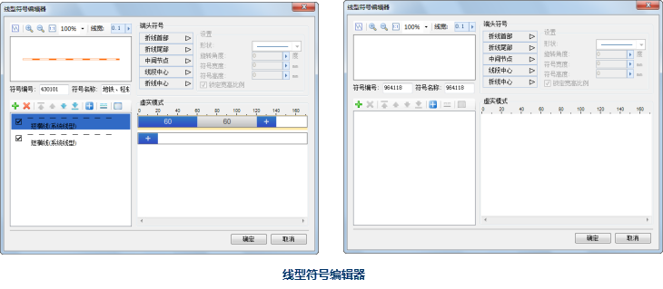

线型符号编辑器，可以通过线型符号选择器打开，具体如下。有关线型符号选择器的打开方式，请参见：[打开线型符号选择器](SymLineSelector1)。

* 在线型符号选择器中，选中任意一个线型符号，然后，单击“编辑”按钮，或者在该线型符号上双击鼠标左键，即可打开线型符号编辑器，线型符号编辑器的左下方区域显示的是选中的线型符号的子线列表，用户可以分别对各个子线进行修改，以实现对选中的符号的编辑操作；
* 在线型符号选择器中，单击“新建”下拉按钮右侧的小三角，然后选择“新建二维线型”，或者直接单击“新建”按钮，均可以打开线型符号编辑器，此时，线型符号编辑器的子线列表是空的，用户可以添加子线，来制作新的二维线型符号。 

  
