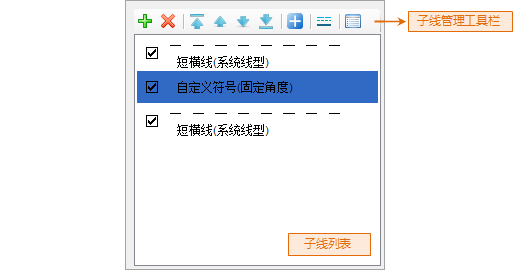
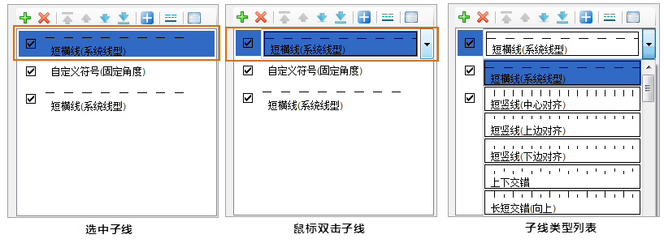
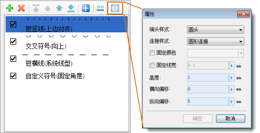

线型符号实质是一个复合线型，即由多个子线构成的线型，线型符号的制作是通过添加子线，通过设置子线的虚实模式、子线的类型和风格样式，从而构造出所需要的线型符号。

线型符号编辑器的子线管理区域，可以对构成线型符号的子线进行有效的管理，如下图所示。

  

  
当新建一个线型符号时（新建线型符号，参见：[新建线型符号](SymLineManager5)），打开线型符号编辑器时，子线管理区域中的子线列表为空，需要用户添加子线来逐步进行线型符号的制作；当编辑线型符号库中的已有的线型符号时（编辑线型符号，参见：[编辑线型符号](SymLineManager6)），打开线型符号编辑器时，子线管理区域中的子线列表将显示构成该线型符号的所有子线。

子线列表中的每一项对应一个子线。

## 新建子线

在线型符号编辑器中，制作一个新的线型符号的第一步就是，新建子线，单击子线管理工具栏上的“”按钮，可以添加一个子线，默认添加的子线的类型为短横线（系统线型）。

用户可以双击该子线，双击后，该子线变为如下（中间图）所示的样子，即变为下拉列表框，单击右侧的下拉按钮，弹出子线类型列表，可以为该子线选择新的子线类型。

  

  
## 删除子线

1. 在子线管理区域中的子线列表中，选中要删除的子线，可以配合 Shift 键和 Ctrl 键，同时选中多个子线；
2. 单击子线管理工具栏上的“删除”按钮，删除选中的子线。删除的子线不可恢复，所以删除子线要谨慎。

## 调整子线顺序

在子线管理区域中，子线列表中的子线的排列顺序，即为线型符号中相应的子线的上下叠加顺序，子线列表中处于最顶端的子线在线型符号中也处于最顶层；子线列表中处于最底端的子线在线型符号中也处于最底层。通过子线管理工具栏上调整子线在线型符号中的层次顺序。

1. 在子线管理区域中的子线列表中，选中要移动顺序的子线，可以配合 Shift 键和 Ctrl 键，同时选中多个子线；
2. 如果单击子线管理工具栏上的“置顶”按钮，将选中的子线移动到最顶端，如果选中的是多个子线，那么这些子线一并移动到所有其他子线的最前面，同时保持选中的子线间的相对顺序不变。 

如果单击子线管理工具栏上的“上移”按钮，将选中的子线向顶端移动一层，即移动到选中子线的前面一个子线的前面，如果选中的是多个子线，那么这些子线一并向顶端移动一层，同时保持选中的子线间的相对顺序不变。

如果单击子线管理工具栏上的“下移”按钮，将选中的子线向底端移动一层，即移动到选中子线的后面一个子线的后面，如果选中的是多个子线，那么这些子线一并向底端移动一层，同时保持选中的子线间的相对顺序不变。

如果单击子线管理工具栏上的“置底”按钮，将选中的子线移动到最底端，如果选中的是多个子线，那么这些子线一并移动到所有其他子线的最后面，同时保持选中的子线间的相对顺序不变。

## 追加已有线型符号

线型符号中的子线不仅可以通过新建获得，还可以将已有的线型符号添加到当前线型符号中，作为构成当前线型符号的子线内容。

1. 单击子线管理工具栏上的“符号追加”按钮；
2. 弹出“选择符号”对话框，该对话框以符号库管理器的方式显示某线型符号库，默认“选择符号”对话框中线型符号库为当前线型符号库，在符号列表中选中要导入的线型符号，配合使用 Ctrl 键可以同时选中多个符号； 

由于“选择符号”对话框以符号管理器的方式显示符号库，因此，在“选择符号”对话框可以进行与符号库管理器类似的符号库管理操作，这里用户可以通过“选择符号”对话框中的“文件”菜单下的功能打开其他线型符号库文件或者加载默认的线型符号库，从而选择要导入的线型符号。

3. 在“选择符号”对话框中选中要追加的线型符号后，单击对话框中的“确定”按钮，选中的线型符号被追加到当前线型的子线列表中，并且追加的内容为所选中的线型符号的所有子线，而不是线型符号本身，因此，用户可以对追加的内容进行进一步的编辑。

## 设置子线类型

线型符号编辑器中提供了丰富的可提供符号制作的子线类型。可以通过以下两种方式设置子线类型。

1. 在子线管理区域中的子线列表中，选中要设置子线类型的某个子线；
2. 单击子线管理工具栏上的更多按钮，将使子线列表中选中的子线变为下拉列表状态，在下拉列表中列出了可以选择的多种子线类型，选中需要的类型，即可将选中的子线设置为所选类型。

另一种设置子线类型的方式：

1. 在子线管理区域中的子线列表中，选中要设置子线类型的某个子线，然后，在选中的子线上双击鼠标；
2. 子线列表中，该选中的子线变为下拉列表状态，单击右侧的下拉按钮，弹出的下拉列表中列出了可以选择的多种子线类型，选中需要的类型，即可将选中的子线设置为所选类型。

## 设置子线属性

这里，子线的属性主要为子线的风格和样式的属性，如子线的颜色、线宽、子线的偏移、子线的端头样式等。

1. 在子线管理区域中的子线列表中，选中要设置属性的子线，可以配合 Shift 键和 Ctrl 键，同时选中多个子线，可以对多个子线进行批量属性设置；
2. 单击子线管理工具栏上的“属性”按钮，弹出“属性”对话框，在对话框中进行子线属性的相关设置，具体设置内容，请参见：[设置子线的风格](SymLineEditor6)。    
  

3. 风格设置完成后，单击“属性”对话框上的“确定”按钮即可。

