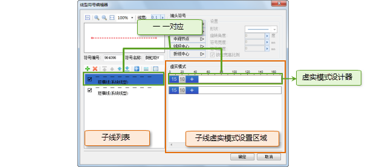
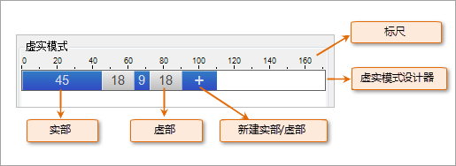
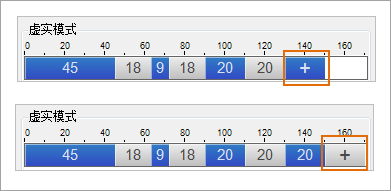
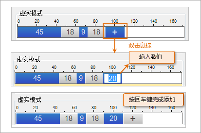
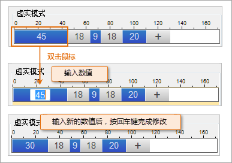
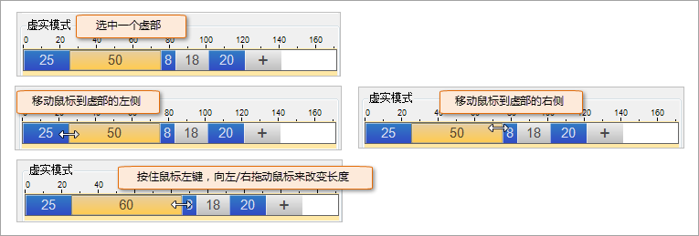
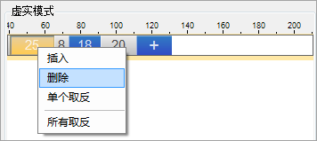
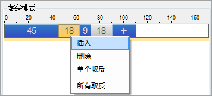
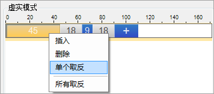
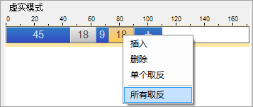

通过虚实模式的设置可以使子线达到虚实交替的绘制效果，有关子线虚实模式的详细描述信息，请参见：[二维线型符号构成](SymLineEditor0.htm)
中的“ **子线虚实模式** ”部分的内容。下面主要介绍如何在线型符号编辑器中实现子线虚实模式的绘制。

如下图所示的区域，为子线虚实模式设置的区域，该区域中的每一项为一个虚实模式设计器，虚实模式设置区域中的虚实模式设计器与子线列表中的子线是一
一对应的关系，如下图，选中的子线右侧的虚实模式设计器，即为设置该子线虚实模式的虚实模式设计器。

  

如下图所示，为一个子线的虚实模式设计器，当用户新建一个子线时，可能会有一个默认的虚实模式，用户可以通过虚实模式设计器上的“
或 ”按钮，添加一个新的实部或虚部，默认添加的实部或虚部有一个默认的实部或虚部长度。

  
## 添加实部/虚部

虚实模式设计器上的“ 或
”按钮，可以实现添加一个新的实部或虚部。“”按钮可以完成实部的添加；“”按钮可以完成虚部的添加。

如果添加按钮为：“”，可以添加一个新的虚实，并且为虚部；如果添加按钮为：“”，可以添加一个新的虚实，并且为实部。

  

如何添加虚实：

1. 双击虚实模式设计器上的“ 或 ”按钮；
2. 双击后，该按钮上出现可编辑的区域，该区域用来输入该实部或虚部的长度，默认为 20，单位为：0.1 毫米，用户输入长度数值后，按回车键（Enter 键），完成实部或虚部的添加，并且其后还会保留一个“ 或 ”按钮，用来创建下一个虚实。 
  

## 设置实部/虚部长度

对已有的实部或虚部，用户可以重新设置其长度，有两种方式可以修改实部或虚部的长度。

### 方式一：输入数值

1. 在要修改长度的实部或虚部上双击鼠标；
2. 双击后，该实部或虚部上的数值区域变为可编辑状态，输入新的长度数值后，按回车键（Enter 键），即可完成长度的修改。
  

### 方式二：拖拽

1. 选中要修改长度的实部或虚部上；
2. 鼠标移动到选中的实部/虚部的左侧或右侧的边界处，鼠标为变成如下图所示的双箭头状态；
3. 鼠标变为双箭头后，按住鼠标左键，同时向左或向右拖动鼠标，可以调整该选中的实部/虚部的长度，调整到满意的数值后，释放鼠标左键即可。 

虚实设置区域得顶部。提供了标识，可以辅助用户设置虚实长度。

  

## 删除实部/虚部

1. 选中要删除的一个实部或虚部；
2. 在选中的实部/虚部上右键鼠标，选择右键菜单中的删除；或者直接按 Delete 键；    
---  
删除一个实部  
3. 选中的实部/虚部，被删除，同时，弹出提示对话框，询问用户是否对删除的实部/虚部后面的虚实进行处理，如果单击“是”按钮，则对删除的实部/虚部后面的虚实进行修改，即对这些虚实取反（原来是实部的变为虚部；原来是虚部的变为实部）；如果单击“否”按钮，则保持删除的实部/虚部后面的虚实模式不变。 

## 插入实部/虚部

在虚实模式设计器上，可以在已有的虚实中插入新的实部或虚部。

1. 在任意一个实部或虚部上单击鼠标右键，新的实部或虚部将插入到该实部或虚部的前面；
2. 选中右键菜单中的“插入”，插入一个新的实部或虚部，插入的新的内容的虚实状况与弹出右键菜单时选中的实部/虚部的虚实状况相同；   
   
3. 在插入完成的同时，弹出提示对话框，询问用户是否对插入的实部/虚部后面的虚实进行处理，如果单击“是”按钮，则对插入的实部/虚部后面的虚实进行修改，即对这些虚实取反（原来是实部的变为虚部；原来是虚部的变为实部）；如果单击“否”按钮，则保持插入的实部/虚部后面的虚实模式不变。   

## 虚实取反

虚实取反，即将原来的实部变为虚部，将原来的虚部变为实部。取反既可以对选中的实部/虚部进行取反，也可以对虚实模式设计器中的所有实部/虚部进行取反。

### 单个实部/虚部取反

1. 在要取反的实部或虚部上单击鼠标右键；
2. 选中右键菜单中的“单个取反”，完成取反操作，则如果选中的是实部，取反后将变为虚部；如果原来是虚部，取反后将变为实部。  
   

也可以在“ 或”按钮上单击鼠标右键，选择“单个取反”，从而改变即将添加的虚实的虚实状况。

### 所有实部/虚部取反

1. 在虚实模式设计器上，在任意一个实部或虚部上单击鼠标右键（也可以在“ 或 ”按钮上单击鼠标右键）；
2. 选中右键菜单中的“所有取反”，完成取反操作，则虚实模式设计器中原来为实部的都变为虚部，原来为虚部的都变为实部。  
    
