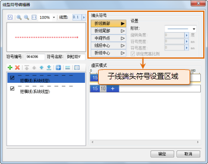
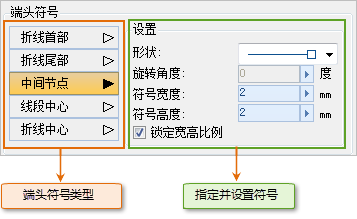
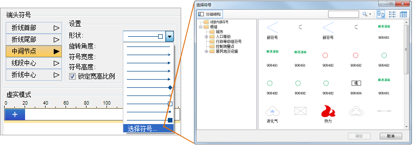

为子线添加端头符号，可以在子线的特殊位置上添加指定的符号，从而在利用线型符号进行符号化线对象时，可以在线对象的特殊位置上，如线对象的起始端点、终止端点、线对象的节点、线对象的中点处等，添加指定的符号。有关子线的端头符号的详细描述，请参见：[二维线型符号构成](SymLineEditor0.html)
中的“ **子线端头符号** ”部分的内容。

如下图所示的区域，为进行子线端头符号设置的区域。

  

首先，在子线列表中选中要添加端头符号的子线，然后，在子线端头符号设置区域进行相应的设置。

如下图所示，这些按钮列出了所提供的所有子线端头符号的类型，选中要添加的端头符号类型对应的按钮，此时，右侧区域可以进行端头符号的设置，包括：指定符号作为端头符号，设置符号的高度、宽度、旋转角度等，该区域的设置都将应用于选中的端头符号类型。

  

* **形状**

通过“形状”下拉列表，可以指定作为端头符号的符号，这里，通过了一些预设的形状可以作为端头符号，用户还可以选择下拉列表中的“选择符号”，打开“选择符号”对话框，选择其他符号作为子线的端头符号。

  
 
* **旋转角度**

设置端头符号的旋转角度，单位为：度。在设置数值时，既可以直接在“旋转角度”数值框中输入数值；也可以单击右侧的箭头弹出滑块，通过调节滑块的位置，或者单击放大或缩小按钮的方式，设置数值。

通过“选择符号”的方式为子线设置端头符号时，所选择的符号默认被旋转了180度，即符号本身的旋转起始角度（0度）与子线端头符号的旋转起始角度（0度）不一致，相差180度。因此，若将子线的端头符号显示角度与符号本身的旋转角度一致，需要设置端头符号的旋转角度等于180度。

* **符号宽度/高度**

设置端头符号的大小，使用高度值和宽度值共同控制符号的大小。如果勾选了“锁定宽高比例”复选框，则保持符号本身的宽高比不变，这样在设置符号高度值时，会相应地计算出符号的宽度值，反之，改变宽度值，高度值也随之发生变化。在设置数值时，既可以直接在数值框中输入数值；也可以单击右侧的箭头弹出滑块，通过调节滑块的位置，或者单击放大或缩小按钮的方式，设置数值。

