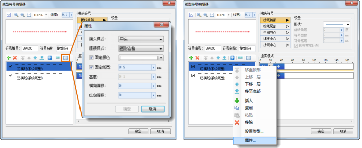
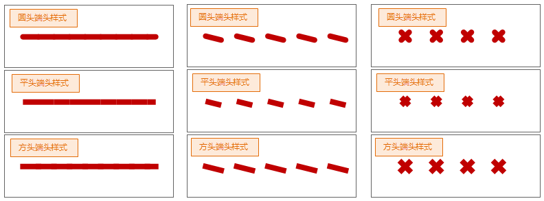
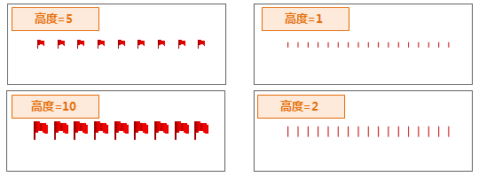

这里所指的子线的风格设置，主要是在子线“属性”对话框设置的子线的风格属性内容，包括：子线的端头样式、连接样式、子线的颜色、线宽，子线的偏移等。

首先，在子线列表中选中要添加设置风格的子线，然后，单击子线管理工具栏上的“属性”按钮；或者在选择的子线上右键鼠标，选择右键菜单中的“属性”项，即可打开“属性”对话框。

  

接下来，就可以在“属性”对话框中设置需要的子线风格。

* **端头样式：** 用来处理子线端点的风格，如下图所示，为设置端头样式后的效果。这里，提供了圆头、方头、平头三种类型的端头样式。  
  
  

* **连接样式：** 如果子线设置了某种连接样式，那么，在使用包含该子线的线型符号去符号化线对象时，连接类型可以处理线对象连接处的转角风格。这里，提供了圆形连接、斜角连接、斜连接三种连接类型。
* **设置子线颜色：** 当勾选“固定颜色”复选框后，其后的颜色按钮可用，可以设置选中的子线的固定颜色。子线颜色固定后，在线型符号选择器中修改线型符号的颜色操作将对该子线无效。
* **设置子线线宽：** 当勾选“固定线宽”复选框后，其后的数值框可用，可以设置选中的子线的固定线宽。在设置数值时，既可以直接在数值框中输入数值；也可以单击右侧的箭头弹出滑块，通过调节滑块的位置，或者单击放大或缩小按钮的方式，设置数值。  
子线线宽固定后，在线型符号选择器中修改线型符号的线宽操作将对该子线无效。

* **设置子线偏移：** 设置子线的横向偏移和纵向偏移。在设置数值时，既可以直接在数值框中输入数值；也可以单击右侧的箭头弹出滑块，通过调节滑块的位置，或者单击放大或缩小按钮的方式，设置数值。有关子线偏移的详细描述，请参见：[二维线型符号构成](SymLineEditor0) 中的“子线偏移”部分的内容。
* **高度：** 当子线有符号元素构成时，或者子线有短竖线构成时，“高度”用来设置构成子线的这些符号元素的高度。在设置数值时，既可以直接在数值框中输入数值；也可以单击右侧的箭头弹出滑块，通过调节滑块的位置，或者单击放大或缩小按钮的方式，设置数值。    
  
    
