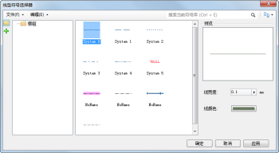

为了方便用户对线型符号的管理、制作和编辑，提供了线型符号相关的管理器，通过界面交互的方式即可完成线型符号的管理、制作和编辑。同时可对线对象进行符号化风格设置，在线型符号选择器中可以设置所使用的线型符号、线型符号的线宽、颜色等风格，并且用户在线型符号选择器中所做的风格设置都将通过对应图层的对象风格展示。

  

## 如何使用线型符号选择器

下面的表格是将线型符号选择器所提供的功能进行分类，每一部分包含了线型符号选择器的若干项功能点。用户可以使用下面的表格定位所需要了解的功能的使用方法。

功能分类 | 包含的功能点简介  
---|---  
[打开线型符号选择器](SymLineSelector1) | 打开线型符号选择器。  
[线型符号选择器界面简介](SymLineSelector2) | 线型符号选择器的界面结构，介绍各部分的作用和使用方式。  
[设置线型符号风格](SymLineSelector3) | 使用线型符号选择器设置线型符号风格。  
[加载更多符号库](SymMarkerSelector4) |在符号选择器中加载更多符号库文件对应的符号库进行符号应用。请参见点符号选择器中有关“[加载更多符号库](SymMarkerSelector4)”的描述。  
**符号库分组结构管理** |对线型符号库的符号分组进行管理，如：新建/移除符号分组，改变符号所在的符号分组，复制/粘贴符号和符号分组，请参见：[符号库分组结构管理](SymMarkerManager3)。  
[导入导出线型符号库文件](SymLineManager3) | 打开线型符号库文件；   加载默认线型符号库；   导入线型符号库文件；     将当前线型符号库导出为线型符号库文件；   导出指定线型符号分组中的线型符号到线型符号库文件。  
[导入线型符号](SymLineManager4) | 将其他线型符号库文件中的符号导入到当前线型符号库中。  
[新建线型符号](SymLineManager5) | 新建一个线型符号，简单制作一个线型符号，并添加到当前线型符号库中。  
[编辑线型符号](SymLineManager6) | 编辑线型符号库中的某个线型符号。  
[管理内部点符号库](InternalSymManager) | 管理线型符号库中的线型符号所使用的点符号。  
[保存工作成果](SymLineManager7) | 通过线型符号库文件保存工作成果；   通过工作空间保存工作成果。  
