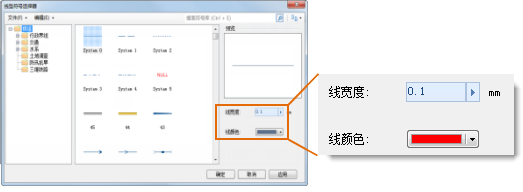

通过线型符号选择器中的符号风格设置区，可以对线型符号进行风格设置，包括线型符号线宽、颜色。

首先，在符号列表中选中一个线型符号，符号风格设置区所设置的风格将应用于该选中的线型符号。

  

下面具体介绍符号风格设置区域可以设置哪些风格，以及设置的方式。

* **线宽度：**

线宽度，用来设置线型符号的粗细，单位为：0.1
毫米。既可以通过输入数值设置；也可以单击右侧的箭头弹出滑块，通过调节滑块的位置，或者单击放大或缩小按钮的方式，设置数值。如果该线型符号在制作时，其中的一些子线指定了固定线宽，那么，这里的线宽设置将对固定线宽的子线无效，所设置的线宽只能修改线型符号中没有固定线宽的子线线宽。

* **线颜色**

线颜色，用来设置线型符号的显示颜色，通过单击右侧的下拉按钮，弹出颜色面板，选择或指定符号的颜色。如果该线型符号在制作时，其中的一些子线指定了固定颜色，那么，这里的颜色设置将对固定颜色的子线无效，所设置的颜色只能修改线型符号中没有固定颜色的子线颜色。
