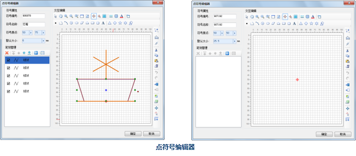
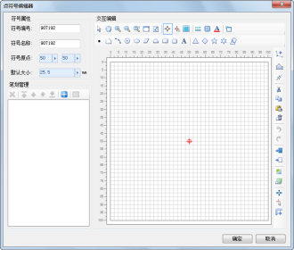

点符号编辑器的打开，可以通过点符号选择器打开，具体如下。有关点符号选择器的打开方式，请参见：[打开点符号选择器](SymMarkerSelector1.htm)和 [打开点符号选择器](SymMarkerSelector1.htm) 。

* 在点符号选择器中，选中任意一个矢量点符号，然后，单击“编辑”按钮，或者在该点符号上双击鼠标左键，即可打开点符号编辑器，点符号编辑器的符号编辑区域显示的是选中的点符号，此时，可以对选中的符号进行进一步的编辑操作；
* 在点符号选择器中，单击“新建”下拉按钮右侧的小三角，然后选择“新建二维符号”，或者直接单击“新建”按钮，也可以打开点符号编辑器，此时，点符号编辑器的符号编辑区域是空白的，此操作是新建一个矢量点符号； 

   
