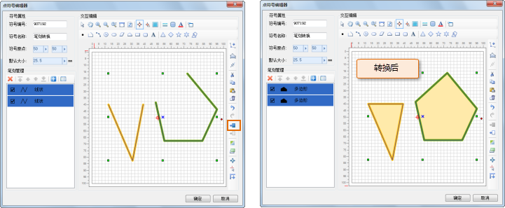

点符号笔划转换主要是进行笔划类型的转换，即可封闭的线条与面间的相互转换（可封闭的线条转换为面域；面转换为封闭线条）。

可封闭的线类型的笔划，是指该线类型的笔划至少具有三个不共线的节点，在转换过程中，一个线类型的笔划转换为一个面类型笔划。

## 线条转换为面域

1. 在符号编辑区域，选中线类型笔划，可以选中多个；
2. 单击工具栏上的“转换成多边形”按钮，即可将线条转换为面类型笔划，一个线类型的笔划转换为一个面类型笔划。   
  
|  
---|---  

## 面对象转换为线对象

1. 在符号编辑区域，选中面类型笔划，可以选中多个；
2. 单击工具栏上的“转换成折线”按钮，即可将面类型笔划转换为线类型笔划，转换获得的线类型笔划为面对象的边界线，一个面类型笔划对应转换后的一个线类型笔划。    
  
  |  
---|---  
