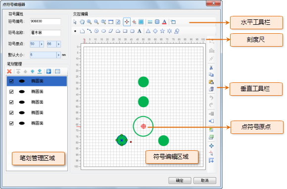
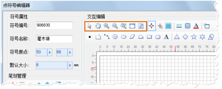
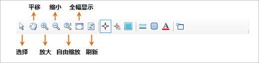

## 点符号编辑器界面结构

下图展示了点符号编辑器的界面布局：

* 符号属性：符号属性区域用来设置或修改点符号的属性，包括：符号编号、符号名称、符号原点和符号默认大小。
* 笔划管理：笔划管理区域用来管理构成点符号的笔划。在制作点符号时，点符号是由点、线、面几何对象构成的，构成点符号的各个几何对象称为笔划。笔划管理包括：删除、添加笔划，移动笔划的层次，设置笔划属性等。
* 符号编辑区域：符号编辑区域是绘制点符号的绘图区域，构成点符号的几何对象都在符号编辑区域进行绘制，符号编辑区域提供了刻度尺以及背景格网，方便符号的精确绘制。
* 水平/垂直工具栏：点符号编辑器所提供的符号编辑功能基本都分布在这几个工具栏上，包括：符号编辑区域的浏览功能、各种几何对象绘制功能、笔划编辑功能、点符号编辑器的工作环境设置功能等。

下文介绍了点符号选择器中一小部分功能的使用，关于点符号选择器的其他功能的使用，将在帮助文档中的其他页面进行详细介绍，用户可以查阅帮助文档的其他部分。

  

## 符号编辑区域的浏览操作

在点符号编辑器中，如下所示的工具栏上的按钮，为用来在符号编辑区域进行浏览的工具，下面具体介绍各个按钮的使用。

  
  
* **选择** ：单击“选择”按钮，将符号编辑区域中的当前操作状态切换为选择对象状态，可以选中点符号中的笔划。
* **平移** ：单击“选择”按钮，将符号编辑区域中的当前操作状态切换为平移状态（即漫游状态），此时，在符号编辑区域按住鼠标左键同时拖动鼠标，可以移动符号编辑区域的视图，实现漫游浏览操作。
* **放大/缩小** ：单击“放大”/“缩小”按钮，将符号编辑区域中的当前操作状态切换为放大/缩小点符号的状态，此时，在符号编辑区域单击鼠标，即可实现一次放大/缩小操作。
* **自由缩放** ：单击“自由缩放”按钮，将符号编辑区域中的当前操作状态切换为自由缩放状态，即自由放大或缩小点符号的状态，此时，在符号编辑区域按住鼠标左键同时上下拖动鼠标，即可实现自由缩放的操作。
* **全幅显示** ：在符号编辑区域，以 1：1 的比例显示符号大小。
* **刷新** ：刷新显示符号编辑区域的视图。
 