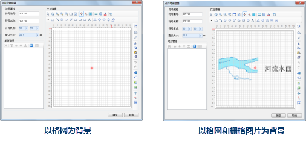
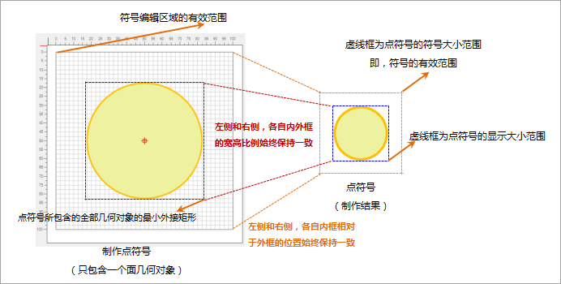
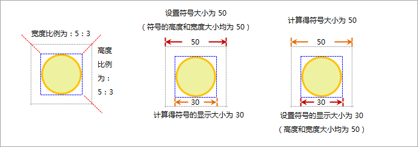

在点符号编辑器中，为了方便用户进行点符号的制作和编辑，点符号编辑器提供了诸如刻度尺、背景格网、捕捉功能等辅助符号编辑的工具，并且用户可以对这些工具进行必要的设置，从而定制符合自己工作特点的符号编辑环境，这里统称为符号编辑器环境设置。下面将详细介绍如何设置符号编辑器环境。

## 符号编辑区域的有效范围

符号编辑区域的有效范围为刻度尺标注的范围，在刻度值范围之外绘制的对象最终将被丢弃。如下图所示，格网所填充的区域即为符号编辑区域的有效范围，在有效范围内绘制的内容才是构成点符号的有效内容。

  

### 符号大小与显示大小

符号编辑区域的有效范围对应着制作后该点符号的有效范围，如下图所示。在实际应用中，通过设置点符号大小来确定该点符号在地图中所显示的大小，其中点符号的大小分为符号大小和显示大小两种：

* 符号的显示大小，是指点符号所包含的全部几何对象的最小外接矩形的尺寸。
* 符号大小，是指符号的有效范围的尺寸。
* 在符号编辑区域中制作点符号时，所绘制的全部几何对象（在符号编辑区域的有效范围内部分）的最小外接矩形与符号编辑区域的有效范围的宽高比等于符号显示大小与符号大小的宽高比。这样，设置了符号大小的值，就可以根据比例，推算出符号的显示大小的值；反之亦然。
* 在符号编辑区域中制作点符号时，所绘制的全部几何对象（在符号编辑区域的有效范围内部分）的最小外接矩形与符号编辑区域的有效范围的相对位置决定了该点符号所包含的全部几何对象的最小外接矩形与符号的有效范围的相对位置。这样，无论点符号的大小如何变化，点符号的对象内容相对于符号的有效范围的位置不变。

如果点符号所包含的全部几何对象的最小外接矩形范围与点符号的有效范围重合，则点符号的符号大小等于显示大小。通常情况下，符号的制作者和符号的使用者不是一个人，那么，使用者并不清楚符号制作者在制作符号时，符号所包含的全部几何对象的最小外接矩形与符号有效范围间的宽高比例关系，此时，符号的显示大小的设置为使用者提供了便利，可以直接控制点符号内容的显示尺寸。

  

如果在进行符号风格设置时，设置上图所示的点符号的符号大小为
50，又知符号的有效范围与该点符号所包含的全部几何对象的最小外接矩形的宽高比例都为：5：3，那么，可以计算得出符号的显示大小为：30；若设置符号的显示大小为
60，则可以计算得出符号大小为 100。

  

下图为，先在点符号编辑器中制作三个点符号，然后，应用三个点符号，主要是对三个点符号进行符号大小和显示大小的设置，通过设置的结果效果图进一步理解符号大小和显示大小的关系和区别。

  

## 符号编辑区域背景设置

符号编辑区域的背景默认为格网，格网与刻度尺的刻度线对齐，通过格网可以实现准确地定位。另外，还可以使用图片作为符号编辑区域的背景，这样可以通过矢量化的方式绘制符号。

 |   
---|---  
以格网为背景 | 以格网和栅格图片为背景    

* 在点符号编辑器中，单击“工作背景设置”按钮，打开“工作背景设置”对话框，这里可以设置符号编辑区域的背景样式。   
   

* 通过勾选“显示格网”复选框，可以控制符号编辑区域的背景格网是否显示：勾选，表示显示；不勾选，表示不显示背景格网。
* 通过勾选“显示栅格地图”复选框，可以添加栅格图片作为符号编辑区域的背景，如果该复选框被勾选，该区域的其他功能被激活，可以进一步对添加到符号编辑区域的背景图片进行设置，并且右侧提供了预览功能，可以实时看到工作背景设置的效果，具体为： 

**添加图像：** 单击“添加图像”按钮，弹出“打开”对话框，查找要作为背景的图片文件并打开，即可将该图片添加到符号编辑区域作为背景图片。

**原始图像：** 选择“原始图像”表示图片文件保持原始大小被添加到符号编辑区域。

**拉伸图像：** 选择“拉伸图像”表示原始图片在添加到符号编辑区域时，将被拉伸以填充整个符号编辑区域的有效范围。

**适应边框：** 选择“适应边框”表示原始图片在添加到符号编辑区域时，将被适当拉伸以保证图片的宽度或高度适合符号编辑区域有效范围的宽度或高度。

* 工作环境设置完成后，单击“工作背景设置”对话框上的“确定”按钮，即可应用设置结果并关闭该对话框；否则，单击“取消”按钮。

## 符号编辑区域刻度尺

符号编辑区域刻度尺既标识了符号编辑区域的有效范围，同时还提供了符号编辑过程中的量化标准，刻度尺的数值单位可以有两种：0.1毫米和百分比，通过垂直工具条上的“”或“”实现刻度尺单位间的切换。如果当前刻度尺的单位为百分比，则垂直工具栏上的切换刻度尺单位的按钮为“”，单击该按钮，可将刻度尺单位切换为0.1毫米，同时该按钮变为“”状态，反之亦然。

  

## 捕捉设置

在点符号编辑器中进行符号编辑时，可以通过捕捉功能准确处理笔划间的相互关系以及定位鼠标的单击位置。符号编辑区域的捕捉分为两类，一是捕捉笔划；二是捕捉符号编辑区域的背景格网线。

* 在点符号编辑器中，单击“开启/关闭捕捉”按钮，可以打开或者关闭符号编辑器区域的捕捉功能，控制在编辑过程中是否需要捕捉必要的对象。
* 如果开启了符号编辑器区域的捕捉功能，那么，单击“工作背景设置”按钮，打开“工作背景设置”对话框，通过是否勾选“格网捕捉”复选框，可以控制在捕捉时是否捕捉符号编辑器区域的背景格网线：勾选，表示捕捉；不勾选，表示不捕捉背景格网线。
* 在点符号编辑器中，单击“捕捉设置”按钮，打开“捕捉设置”对话框，通过该对话框可以设置捕捉类型和捕捉参数。  
  

## 符号编辑区域全屏显示

在点符号编辑器中，单击“切换到大图模式”按钮，可以使符号编辑区域全屏显示，通过“ESC”键或者“切换回普通模式”按钮，可以回到普通模式下；也可以在全屏模式的黑色区域的任意位置单击鼠标，取消全屏状态回到普通模式。

  
