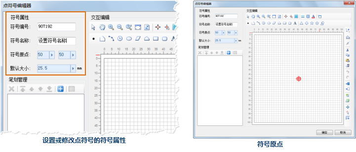
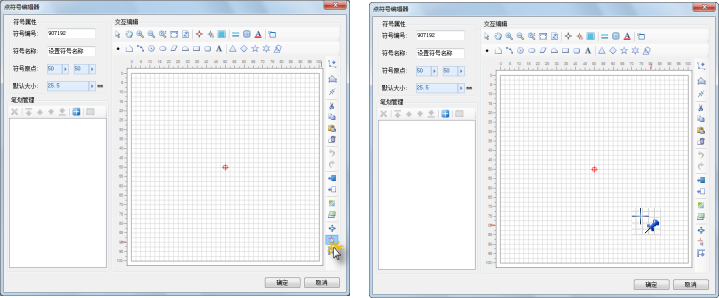

点符号编辑器的符号属性区域，用来显示、设置、修改点符号的信息，包括以下几方面内容，其中符号编号和符号名称是点符号的必需信息：

* 符号编号：符号编号用来在符号库中唯一标识该符号，在同一个符号库中，不同符号的符号编号不能相同。
* 符号名称：符号在符号库中的显示名称，在同一个符号库中，符号的名称可以同名。
* 符号原点：用来设置符号的原点在符号编辑区域的位置，如下图所示，符号编辑区域中的红色十字标识即为符号原点。另外，符号的原点也是符号的锚点，在对点对象符号化时，描点的位置将位于点对象的坐标点上。
* 默认大小：设置点符号的默认大小，当用户通过点符号选择器设置点符号的大小时，如果指定的大小值为0时，点符号的大小将取默认大小的数值。点符号默认大小的数值范围为0到25.5之间，单位为：毫米。  

 

## 设置符号原点

设置符号原点的途径有以下两种：

* 通过符号属性区域的符号原点右侧的两个数值框设置，既可以直接输入数值，也可以通过右侧的小箭头打开滑块来调整数值，其中，第一个数值表示横坐标数值；第二个数值表示纵坐标数值。    
  
---  
* 单击符号编辑区域右侧垂直工具栏中的“设置原点”按钮，然后，将鼠标移动到符号编辑区域，鼠标状态变为如下（右图）所示的状态，在目标位置单击鼠标，即可将符号原点设置为鼠标点击位置。   
  
