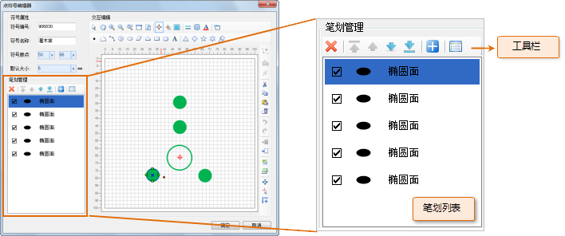
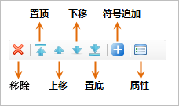
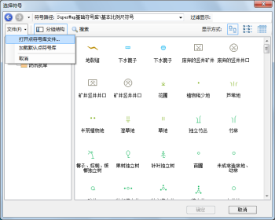

在点符号编辑器中，在制作符号时，在符号编辑区域所绘制的每一个几何对象称为一个笔划，即构成点符号的每一个几何对象称为笔划。在制作点符号时，可以在符号编辑区域绘制点对象、线对象、面对象以及文本对象，在符号编辑区域的有效范围内所绘制的内容都是最终组成该点符号的图形内容。组成点符号的对象可以是点、线、面和文本对象，因此，相应地，点符号的笔划也分为点、线、面和文本四种类型。

在点符号编辑器左下角的区域，笔划管理区域，就是用来组织和管理符号编辑区域所绘制的点符号中的每一个笔划。笔划管理区域由工具栏和笔划列表两部分构成，其中，工具栏组织了管理笔划的功能按钮；笔划列表显示了构成点符号（即，在符号编辑区域所绘制的点符号）的所有的笔划，列表中的每一项对应点符号的一个笔划。

  

## 笔划列表

* 笔划列表中的每一项对应点符号的一个笔划，即在符号编辑区域绘制的一个几何对象。
* 每一个笔划项的显示名称和显示图形均表示该笔划对应的几何对象的类型。
* 每一个笔划项最前端的复选框，用来控制该笔划是否在符号编辑区域中显示出来，如果勾选，表示显示；不勾选，表示不显示。
* 笔划列表中的每一项的先后顺序代表相应的笔划在符号编辑区域中的上下叠置顺序，即笔划列表中处在前面的笔划是叠加在列表中后面的笔划之上的。
* 在笔划列表中选中笔划项时，在符号编辑区域对应的笔划也将是选中状态，反之亦然。

## 笔划管理工具栏

笔划管理工具栏上的各个按钮的功能及使用情况如下：

  

* **移除：** 用来删除笔划列表中选中的笔划。在笔划列表中选中要删除的笔划，可以配合使用 Shift 键或 Ctrl 键选中多个笔划，然后，单击“移除”按钮，即可删除所选中的笔划。
* **置顶：** 用来将笔划列表中选中的某个笔划移动到列表的第一位，即将符号编辑区域中相应的笔划移动到最顶层，也就是其它所有笔划之上。
* **上移：** 用来将笔划列表中选中的某个笔划向前移动一位，即移动到前一个笔划的前面。
* **下移：** 用来将笔划列表中选中的某个笔划向后移动一位，即移动到后一个笔划的后面。
* **置底：** 用来将笔划列表中选中的某个笔划移动到列表的最后一位，即将符号编辑区域中相应的笔划移动到最底层，也就是其它所有笔划之下。
* **符号追加：** 将其他符号库中的点矢量符号作为一个复合笔划添加到当前点符号中，具体操作为：   

1. 单击“符号追加”按钮，打开“选择符号”窗口，该窗口的结构类似于点符号选择器，其中显示的符号为当前符号库中的点符号；
2. 可以通过“选择符号”窗口中，“文件”菜单下的“打开点符号库文件”项，打开其他点符号库文件，从而选择其他点符号库中的矢量点符号作为追加目标；    
  
    
 
3. 在“选择符号”窗口中选中一个要作为复合笔划追加到当前所编辑的符号中的符号，必须为矢量点符号； 

此处，可以选中多个点符号作为追加目标，那么，每一个点符号对应一个复合笔划。

4. 选中要追加的符号后，单击“确定”按钮，即可完成笔划的追加，追加到当前所编辑的点符号的复合笔划，默认添加到笔划列表的最前端。
* **属性：** 用来设置笔划列表中所选中的笔画的风格。选中一个或多个笔划，然后，单击“属性”按钮，弹出“属性”对话框，即可在对话框中完成笔划风格的设置。根据选中的笔划类型不同，“属性”对话框中内容有所差异，有关笔划风格的设置操作，请参见：[设置点符号笔划风格](SymMarkerEditor7) 。
