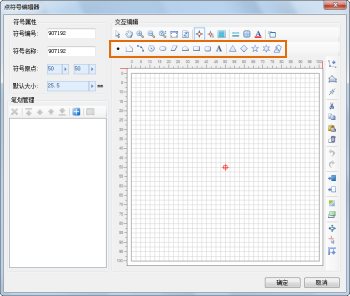

点符号的绘制，即在符号编辑区域绘制组成该点符号的各种图形元素，也就是，绘制构成点符号的几何对象、绘制点符号笔划。绘制的笔划分为点、线、面和文本四大类型。

点符号编辑区域绘制对象时，必须在符号编辑区域的有效范围内绘制，否则，超出有效范围的部分将被裁剪掉。

点符号笔划绘制将使用如下所示的工具栏中的功能，进行各种几何对象的绘制，每一个几何对象为一个笔划。

  

在使用工具栏中提供的按钮绘制相应的几何对象前，可以通过工具栏上的线风格按钮、填充风格按钮、文本风格按钮设置即将绘制的几何对象的风格。

  

## 如何使用工具栏中的按钮绘制笔划

功能按钮 | 操作描述  
---|---  
 点 | 绘制点几何对象：  1. 单击“点”按钮； 2. 在符号编辑区域中，在目标位置单击鼠标，完成一个点对象的绘制，如果再次绘制点对象，重复以上操作步骤。  
 线 | 绘制折线几何对象：   1. 单击“线”按钮； 2. 在符号编辑区域中，在目标位置连续单击鼠标，绘制折线的控制点，从而获得由这些控制点连接成的折线对象，单击鼠标右键，完成折线绘制。  另外，折线控制点的确定，既可以通过在适当的位置直接单击鼠标获得；也可以通过参数化绘制功能实现精确绘制，绘制折线的参数为极坐标参数，即通过输入当前绘制线段的长度和角度来绘制当前线段，通过Tab 键实现在两个参数间的切换。 如果再次绘制折线对象，重复以上操作步骤。  
 圆弧 | 绘制三点圆弧： 1. 单击“圆弧”按钮；  2. 在符号编辑区域中，在目标位置连续单击鼠标，确定圆弧上的三个控制点，从而完成一个圆弧对象的绘制，如果再次绘制点对象，重复以上操作步骤。  
 圆 | 绘制圆面几何对象： 1. 单击“圆”按钮； 2. 在符号编辑区域中，在目标位置单击鼠标，确定圆的圆心位置； 3. 移动鼠标，在适当位置单击鼠标，完成圆面的绘制，鼠标单击位置与圆心位置的距离为圆的半径。另外，也可以在所显示的数值框中输入数值来确定圆的半径。如果再次绘制圆面对象，重复以上操作步骤。  
 椭圆 | 绘制椭圆面几何对象： 1. 单击“椭圆”按钮； 2. 在符号编辑区域中，在目标位置连续单击鼠标，通过确定两个控制点，完成一个椭圆面对象的绘制。两个控制点为该椭圆面的最小外接矩形的对角线的两个端点。如果再次绘制点对象，重复以上操作步骤。  
 平行四边形 |绘制平行四边形面几何对象： 1. 单击“平行四边形”按钮； 2. 在符号编辑区域中，在目标位置连续单击鼠标，通过确定两个控制点，来确定平行四边形的一条边； 3. 移动鼠标，在适当位置单击鼠标，确定平行四边形的第二条边，即第一条边的邻边，从而完成一个平行四边形的绘制。如果再次绘制平行四边形，重复以上操作步骤。  
 面 | 绘制多边形几何对象： 1. 单击“面”按钮； 2. 在符号编辑区域中，在目标位置连续单击鼠标，绘制多边形的控制点，从而获得由这些控制点连接成的多边形，单击鼠标右键，完成多边形绘制。  另外，多边形控制点的确定，既可以通过在适当的位置直接单击鼠标获得；也可以通过参数化绘制功能实现精确绘制，参数为极坐标参数，即通过输入当前绘制的多边形边的长度和角度来绘制多边形的一条边，通过 Tab 键实现在两个参数间的切换。如果再次绘制多边形对象，重复以上操作步骤。  
 矩形 | 绘制矩形几何对象：  1. 单击“矩形”按钮； 2. 在符号编辑区域中，在目标位置连续单击鼠标，确定矩形对角线的两个端点，完成一个矩形对象的绘制。如果再次绘制矩形对象，重复以上操作步骤。  
 圆角矩形 | 绘制圆角矩形几何对象： 1. 单击“圆角矩形”按钮； 2. 在符号编辑区域中，在目标位置连续单击鼠标，确定圆角矩形的最小外接矩形对角线的两个端点； 3. 移动鼠标，在适当位置单击鼠标，确定圆角矩形的圆角部分，从而完成圆角矩形的绘制。如果再次绘制圆角矩形，重复以上操作步骤。  
 文本 | 绘制文本对象： 1. 单击“文本”按钮； 2. 在符号编辑区域中，在目标位置单击鼠标，弹出“设置文字”对话框； 3. 在“设置文字”对话框中，输入文本对象中的文字内容，同时可以设置文本的字体、字号以及字体颜色，设置完成后，单击“确定”按钮，完成一个文本对象的绘制。如果再次绘制文本对象，重复以上操作步骤。  
 正三角形 | 绘制正三角形几何对象： 1. 单击“正三角形”按钮； 2. 正三角形的绘制是通过绘制辅助圆实现的，即正三角形的外接圆。在符号编辑区域中，在目标位置单击鼠标，确定正三角形外接圆的圆心； 3. 移动鼠标，在适当位置单击鼠标，确定外接圆的半径以及正三角形的旋转角度，从而完成一个正三角形对象的绘制，所绘制的正三角形为封闭的线对象。如果再次绘制正三角形，重复以上操作步骤。  
 正四边形 | 绘制正四边形几何对象： 1. 单击“正四边形”按钮； 2. 正四边形的绘制是通过绘制辅助圆实现的，即正四边形的外接圆。在符号编辑区域中，在目标位置单击鼠标，确定正四边形外接圆的圆心； 3. 移动鼠标，在适当位置单击鼠标，确定外接圆的半径以及正四边形的旋转角度，从而完成一个正四边形对象的绘制，所绘制的正四边形为封闭的线对象。如果再次绘制正四边形，重复以上操作步骤。  
 五角星 | 绘制五角星几何对象： 1. 单击“五角星”按钮； 2. 五角星的绘制是通过绘制辅助圆实现的，即五角星的外接圆。在符号编辑区域中，在目标位置单击鼠标，确定五角星外接圆的圆心； 3. 移动鼠标，在适当位置单击鼠标，确定外接圆的半径以及五角星的旋转角度，从而完成一个五角星对象的绘制，所绘制的五角星为封闭的线对象。如果再次绘制五角星，重复以上操作步骤。  
 六芒星 | 绘制六芒星几何对象： 1. 单击“六芒星”按钮； 2. 六芒星的绘制是通过绘制辅助圆实现的，即六芒星的外接圆。在符号编辑区域中，在目标位置单击鼠标，确定六芒星外接圆的圆心； 3. 移动鼠标，在适当位置单击鼠标，确定外接圆的半径以及六芒星的旋转角度，从而完成一个六芒星对象的绘制，所绘制的六芒星为封闭的线对象。如果再次绘制六芒星，重复以上操作步骤。  
 其他正多边形 | 根据给定的参数绘制正多边形对象：   正多边形的绘制将通过参数化绘制和鼠标绘制相结合的方式完成。 1. 单击“其他正多边形”按钮，弹出“绘制正多边形”对话框:   边数：设置绘制多少边的正多边形。 辅助圆位置：正多边形的绘制是通过绘制辅助圆来实现的，这里确定正多边形与辅助圆的位置关系是外接还是内切。 绘制类型：设置所绘制的正多边形是面对象还是线对象。 保留辅助圆：是否保留所绘制的辅助圆。  中心点：勾选该项，通过数值来确定辅助圆的中心点位置，否则辅助圆中心点位置通过鼠标单击确定。 半径：勾选该项，通过数值来确定辅助圆的半径；否则，在绘制过程中，辅助圆半径通过鼠标单击确定。 旋转角度：勾选该项，通过数值来确定正多边形的旋转角度；否则，在绘制过程中，通过鼠标单击确定。 2. 如果正多边形的绘制参数都在“绘制正多边形”对话框中设置完成，那么，单击对话框中的“确定”按钮后，即可获得绘制结果。否则，在符号编辑区域中，在目标位置连续单击鼠标，通过鼠标完成一个正多边形的绘制（没有在“绘制正多边形”对话框中设置的参数，都通过鼠标单击确定）。如果再次绘制正多边形对象，重复以上操作步骤。  
