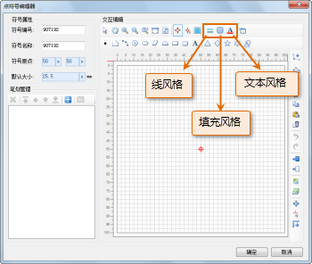
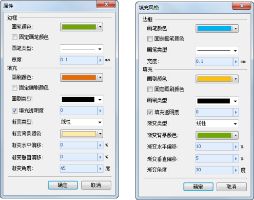
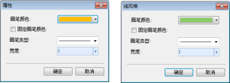
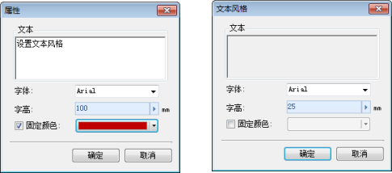

点符号笔划风格的设置分为两种应用场景，一是，对已绘制的点符号笔划进行风格设置；二是，对即将绘制的点符号笔划，进行风格的预设置。

关于点符号笔划风格的设置是通过相应的对话框进行设置的，由于点符号笔划分为点、线、面和文本类型，所以笔划风格设置对话框也相应地具有不同的内容，大致分为：线型风格、填充风格和文本风格。

## 获取笔划风格设置对话框

* 在点符号编辑器中的笔划管理区域，选中笔划列表中的某个笔划（可以多选，实现笔划风格的批量设置），然后，单击笔划管理工具栏上的“属性”按钮或者单击鼠标右键，选择右键菜单中的“属性”项，弹出“属性”对话框，该对话框进行笔划风格修改的场所，用来设置已绘制笔划的风格，根据笔划类型不同，该对话框的内容有所不同。
* 在点符号编辑器中的符号编辑区域，选中某个笔划（可以多选，实现笔划风格的批量设置），单击鼠标右键，选择右键菜单中的“属性”项，弹出“属性”对话框，该对话框进行笔划风格修改的场所，用来设置已绘制笔划的风格，根据笔划类型不同，该对话框的内容有所不同。
* 在点符号编辑器中，通过如下所示工具栏上的按钮，弹出相应笔划类型的风格设置对话框，可以进行线、面、文本风格的设置，从而确定即将绘制的线、面、文本对象的风格。   
   

## 面类型的笔划风格设置（包括面的边框和填充风格）

对已有面类型的笔划风格设置，通过“属性”对话框设置，如下所示（左图）；对即将绘制的面类型的笔划风格设置，通过“填充风格”对话框设置，如下所示（右图）；两者对话框内容完全相同，设置方式也相同，下面统一进行介绍。

 |   
---|---  

边框区域的内容用来设置面对象的边框线风格。另外，在设置即将绘制的笔划风格时，面边框线风格的设置会影响线笔划风格的设置，即设置面边框的风格也就同时修改了线风格；反之，修改线风格也就同时修改了面边框线风格。

* **画笔颜色：** 设置线条颜色。
* **固定画笔颜色：** 如果该复选框被勾选，则所设置的线条颜色固定，即在进行地图符号化时，该点符号中的固定画笔颜色的线条不能通过点符号选择器来改变其颜色。如果该复选框没被勾选，表示其颜色可以在地图符号化时，通过点符号选择器修改其显示颜色。
* **画笔类型：** 设置线条的线型。
* **宽度：** 设置线的粗细，数值单位为：毫米。

填充区域的内容用来设置面对象的填充风格。

* **画刷颜色：** 设置填充内容的颜色。
* **固定颜色：** 如果该复选框被勾选，则所设置的填充颜色固定，即在进行地图符号化时，该点符号中的固定画刷颜色的填充区域不能通过点符号选择器来改变其颜色。如果该复选框没被勾选，表示其颜色可以在地图符号化时，通过点符号选择器修改其显示颜色。
* **画刷类型：** 设置填充内容的样式。
* **填充透明度：** 设置填充的透明效果，数值范围为0至100，0 表示完全不透明，100 表示完全透明。既可以通过输入数值设置；也可以单击右侧的箭头弹出滑块，通过调节滑块的位置，或者单击放大或缩小按钮的方式，设置数值。

除了以上风格设置外，还可以对面笔划的填充设置渐变风格，渐变主要使用双色渐变，即从起始颜色过渡变化到终止颜色，其中，起始颜色由“画刷颜色”指定，终止颜色由“渐变背景颜色”指定，并且，渐变的起始颜色可以通过是否固定颜色的方式来控制符号在应用时可否修改其颜色，但是，渐变的终止颜色一旦设定，在符号应用时不可修改。

* 如果要设置渐变风格，需要选择一种“渐变类型”，默认状态下，渐变类型为无渐变，即不使用渐变风格，因此，需要选择任意一种需要的渐变模式，这里提供了线性、辐射、圆锥、方形四种渐变类型。
* 渐变背景色，即指定渐变的终止颜色。
* 渐变水平/垂直偏移，用来指定渐变用来设置渐变填充中心点相对于填充范围中心点的水平或垂直的偏移百分比。
* 渐变角度，用来指定渐变填充的颜色渐变方向，该参数值主要影响线性渐变、方形渐变和圆锥渐变，而对辐射渐变没有影响。

关于面笔划的填充风格的设置，与对地图中的面对象进行填充风格设置操作中的渐变填充类似，具体描述可以参见：[
设置填充符号风格](SymFillSelector3.htm) 中的“渐变填充”部分内容。

## 线类型的笔划风格设置

对已有线类型的笔划风格设置，通过“属性”对话框设置，如下所示（左图）；对即将绘制的线类型的笔划风格设置，通过“线风格”对话框设置，如下所示（右图）；两者对话框内容完全相同，设置方式也相同，下面统一进行介绍。

 |   
---|---  

在设置即将绘制的笔划风格时，线风格的设置会影响填充风格中边框线风格的设置，即设置线风格也就同时修改了填充风格中的边框风格；反之，修改填充风格中的边框风格也就同时修改了线风格。

* **画笔颜色：** 设置线条颜色。
* **固定画笔颜色：** 如果该复选框被勾选，则所设置的线条颜色固定，即在进行地图符号化时，该点符号中的固定画笔颜色的线条不能通过点符号选择器来改变其颜色。如果该复选框没被勾选，表示其颜色可以在地图符号化时，通过点符号选择器修改其显示颜色。
* **画笔类型：** 设置线条的线型。
* **宽度：** 设置线的粗细，数值单位为：毫米。

## 点类型的笔划风格设置

在点符号编辑器中，只能对已绘制的点类型的笔划进行风格修改，而不能预先设置即将绘制的点类型笔划的风格。选中要修改风格的点类型的笔划，打开“属性”对话框，点类型笔划风格设置的属性对话框与线类型笔划风格设置使用相同的对话框。

* **画笔颜色：** 设置点的颜色。
* **固定画笔颜色：** 如果该复选框被勾选，则所设置的点颜色固定，即在进行地图符号化时，该点符号中的固定画笔颜色的点不能通过点符号选择器来改变其颜色。如果该复选框没被勾选，表示其颜色可以在地图符号化时，通过点符号选择器修改其显示颜色。
* **宽度：** 设置点的大小，数值单位为：毫米。

## 文本类型的笔划风格设置

对已有文本类型的笔划风格设置，通过“属性”对话框设置，如下所示（左图）；对即将绘制的文本类型的笔划风格设置，通过“文本风格”对话框设置，如下所示（右图）。两者对话框内容和设置方式基本相同，下面统一进行介绍。

 |   
---|---    

* **文本：** 设置文本内容。需要注意的是，通过"属性"对话框对已有文本类型进行笔划风格设置时，可以对文本进行修改；通过"文本风格"对话框对即将绘制的文本类型进行风格预设时，不能指定文本内容。
* **字体：** 通过在右侧的下拉列表中选择一种字体，来设置文本的字体风格。
* **字高：** 即字体高度，可以在"字体高度"右侧的数值框中输入数值来设置；也可以使用数值框右侧的上下箭头按钮，以步长为1来调整数值。字体的高度值大小是指从文字笔划的最顶端到文字笔划的最低端。使用字高来设置文字大小，可以避免使用字号时，由于不同的地图比例尺而造成字体大小的误差。
* **固定颜色：** 如果该复选框被勾选，则所设置的文本颜色固定，即在进行地图符号化时，该点符号中固定画笔颜色的文本不能通过点符号选择器来改变其颜色。如果该复选框没被勾选，表示其颜色可以在地图符号化时，通过点符号选择器来修改其颜色。
