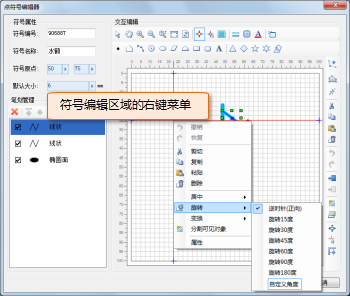

本部分主要介绍点符号编辑器提供的简单的点符号笔划编辑功能，主要包括：笔划的删除、笔划的复制与粘贴、编辑操作的撤销与恢复、笔划节点编辑、笔划布局（对齐）、笔划旋转、笔划变换（镜像与翻转）。下面对这些功能的使用进行详细介绍。

## 删除笔划

1. 选中要删除的笔划，即可以通过笔划管理区域的笔划列表选中笔划，也可以在符号编辑区域选中要删除的笔划，可以配合 Shift 键或 Ctrl 键选中多个笔划；
2. 按 Delete 键或者单击工具栏上的“删除”按钮，删除所选中的笔划。另外，在符号编辑区域，通过右键菜单中的“删除”项以及在笔划管理区域，通过右键菜单中的“移除”项，都可以删除所选中的笔划。  

  

## 复制/剪切/粘贴笔划

1. 选中要复制的笔划，即可以通过笔划管理区域的笔划列表选中笔划，也可以在符号编辑区域选中要删除的笔划，可以配合 Shift 键或 Ctrl 键选中多个笔划；
2. 单击工具栏中的“复制”或“剪切”按钮，可以将选中的笔划复制到剪切板中；也可以通过符号编辑区域的右键菜单，进行复制或剪切；
3. 单击工具栏中的“粘贴”按钮，可以将复制到剪切板中的笔划进行粘贴；也可以通过符号编辑区域的右键菜单，进行粘贴。    
   

## 编辑操作的撤销与恢复

工具栏中的“撤销”与“恢复”按钮，以及符号编辑区域的“撤销”与“恢复”项，可以分别实现撤销所进行的符号编辑操作及恢复所撤销的操作。

  

## 编辑笔划节点

点符号笔划节点的编辑包括：添加节点和编辑节点两部分内容。

  

1. 在符号编辑区域，选中要编辑的笔划，也可以通过笔划管理区域的笔划列表选中某个笔划；
2. 单击“添加节点”按钮，此时，符号编辑区域的操作状态切换为添加节点状态，并且，选中的笔划将显示其所有节点，在选中笔划的目标位置单击鼠标，即可在相应位置添加节点；
3. 单击“编辑节点”按钮，此时，符号编辑区域的操作状态切换为编辑点状态，并且，选中的笔划将显示其所有节点，可以进行如下编辑操作：  
（1）选中某个节点，同时按住鼠标左键不放，移动鼠标，可以移动该节点；  
（2）选中某个节点，按 Delete 键，删除选中的节点。

## 笔划布局

笔划布局主要是指笔划在符号编辑区域的位置布局，既包括笔划相对于符号编辑区域的位置关系；也包括笔划间的位置关系。

1. 在符号编辑区域，选中需要操作的笔划，也可以通过笔划管理区域的笔划列表选中笔划，可以同时选中多个笔划；
2. 右键单击鼠标，打开符号编辑区域的右键菜单，可以通过右键菜单中的如下项，完成笔划位置的布局：    

    * **对齐:** 其下的子项可以实现对多个选中的笔划设置笔划间的相对位置关系。以第一个选中的笔划为参考对象进行对齐操作。
    * **相等:** 其下的子项可以实现对多个选中的笔划设置笔划间的相对大小关系。
    * **等距:** 其下的子项可以实现对多个选中的笔划设置笔划间的距离关系。
    * **居中:** 当选中一个笔划时，其下的子项用来设置选中的某个笔划的中心点相对于符号编辑区域中心点的关系；当选中多个笔划时，用来设置选中的多个笔划的最小外接矩形的中心相对于符号编辑区域中心点的关系。

## 笔划旋转

1. 在符号编辑区域，选中需要操作的笔划，也可以通过笔划管理区域的笔划列表选中笔划，可以同时选中多个笔划；
2. 右键单击鼠标，打开符号编辑区域的右键菜单，可以通过右键菜单中的“旋转”项下的子项，完成笔划的旋转。既可以通过给定的角度旋转，也可以在“自定义角度”处输入角度值进行其他角度的旋转。   
   

## 笔划充满

笔划充满功能，可以将符号编辑区域中当前所绘制的所有内容“充满”符号编辑区域的有效范围，这里，所谓的“充满”采用了一定的算法，充满操作可能会导致部分笔划的发生变形。

单击如下图所示的“笔划充满”按钮，即可将当前符号编辑区域中的点符号“充满”编辑区域的有效范围。

 

## 笔划变换（镜像与翻转）

### **翻转:**

1. 在符号编辑区域，选中需要操作的笔划，也可以通过笔划管理区域的笔划列表选中笔划，可以同时选中多个笔划；
2. 右键单击鼠标，打开符号编辑区域的右键菜单，可以通过右键菜单中的“变换”项下的“水平翻转”及“垂直翻转”子项，完成笔划的翻转。    
 
   

### **镜像:**

1. 在符号编辑区域，选中需要操作的笔划，也可以通过笔划管理区域的笔划列表选中笔划，可以同时选中多个笔划；
2. 右键单击鼠标，打开符号编辑区域的右键菜单，可以通过右键菜单中的“变换”项下的“镜像”子项；
3. 在符号编辑区域，绘制镜像基准线，单击鼠标，确定镜像线段的两个端点，完成对选中笔划的镜像操作。  !  
  
