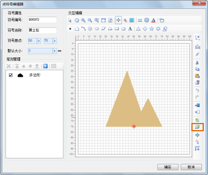
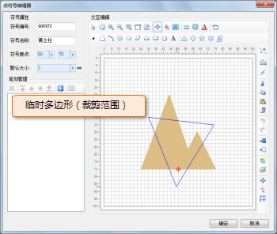
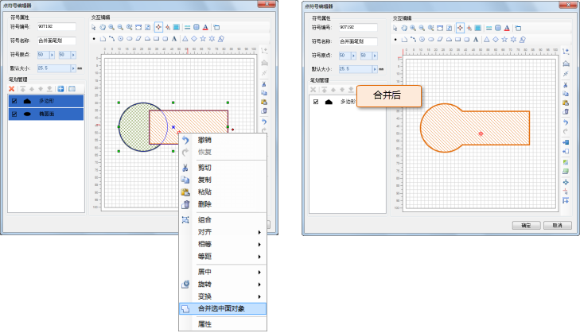
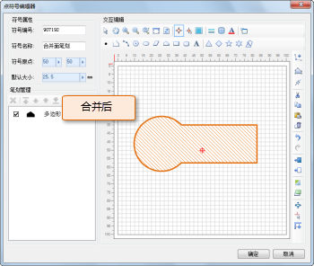
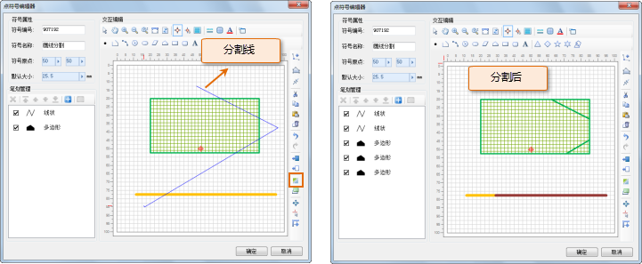
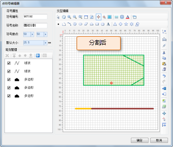

本部分主要介绍点符号的笔划间的几何运算，可以理解为构成点符号的几何对象间的空间几何运算，主要包括：笔划间的裁剪运算操作、合并运算操作和画线分割操作。下面对这些功能的使用进行详细介绍。

## 裁剪运算操作

裁剪运算操作，是在符号编辑区域，通过绘制一个裁剪区域（临时多边形），来裁剪该区域内的笔划，在裁剪区域内的笔划部分被保留，在裁剪区域外的部分被裁剪掉。

1. 单击工具栏上的“裁剪对象”按钮；
2. 在符号编辑区域，通过连续单击鼠标，确定裁剪范围边界控制点，即绘制临时多边形，单击鼠标右键结束绘制，同时完成裁剪操作。     

 |   
---|---  

## 合并运算操作

合并运算操作，是对符号编辑区域中选中的多个面类型的笔划进行合并操作，即融合为一个面对象。

1. 在符号编辑区域，选中要进行合并的面类型的笔划，并且，要求选中的面类型笔划间有重叠区域；
2. 在选中的笔划上右键鼠标，在弹出的右键菜单中选择“合并选中面对象”，所选中的面对象进行合并。   
  
  |  
---|---  

## 画线分割操作

画线分割操作，是在符号编辑区域，通过绘制临时分割折线，对折线所经过的笔划几何对象进行分割。

1. 单击工具栏上的“画线分割”按钮；
2. 在符号编辑区域，通过连续单击鼠标，确定分割线上的控制点，即绘制临时折线，单击鼠标右键结束绘制，同时对折线所经过的几何对象进行分割。    
  
 |   
---|---  
