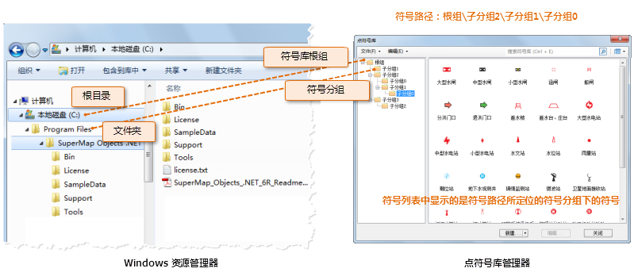

SuperMap 对符号库中的符号采用逻辑分组的方式进行管理，点符号库、线型符号库和填充符号库都采用同样的逻辑管理方式。

便于更好地理解符号逻辑分组的管理方式，我们通过类比 Windows
资源管理器的采用文件夹管理磁盘文件的方式，来理解符号逻辑分组的管理方式。在后续的描述中，符号逻辑分组简称符号分组。

Windows
资源管理器通过文件夹来组织文件，对文件进行分类存储，而实质上，文件都是存储在磁盘上，磁盘上并没有文件夹的概念，文件夹只是一种文件的逻辑管理组织，为了方便用户对文件的管理、查找和使用。例如：

* 路径“C:\”表示磁盘根目录，根目录下包含了一系列的文件和文件夹，每一个文件夹又包含了一系列的文件和文件夹，以此类推，文件夹既可以包含文件，也可以嵌套其他文件夹。
* 我们在定位存储在 C 盘某个位置的文件时，通过该文件夹的路径进行定位，文件的绝对路径为：从 C 盘根目录到该文件目标存储位置所经过的文件夹构成的路径，如“C:\SuperMap\Data\City\Changchun.udb”表示 Changchun.udb 文件的绝对存储路径。

对于符号库的逻辑分组管理方式，涉及以下几个概念：根组、符号分组、符号：

* 根组：符号库的根组是符号库逻辑管理组织的根目录，相当于 Windows 资源管理器逻辑管理组织中的磁盘根目录，例如：相当于“C:\”根目录；
* 符号分组：符号分组是符号库根组下的子目录，符号分组相当于 Windows 资源管理器逻辑管理组织中的文件夹；文件夹有文件夹名称，对应地，符号分组也有符号分组的名称；
* 符号：符号相当于文件。 
* 与 Windows 资源管理器逻辑管理组织相同，符号根组下可以包含若干个符号和若干个符号分组；各个符号分组下可以包含若干个符号和符号分组，即符号分组可以嵌套，以此类推，从而将符号库中存储的符号进行分类存放和管理。
* 在符号库中定位符号存放的位置，即符号所在的符号分组，也是通过路径定位的，路径为绝对路径：从符号根组到符号所在的目标符号分组所经过的所有符号分组构成的路径，如：“根组\分组A\分组C\”表示可以浏览到名称为“符号分组C”的符号分组下的符号内容。
* 在 Windows 资源管理器中，可以在任意路径下新建文件夹，然后，在新的文件夹中存放新的文件；或者将其他路径下的文件移动到另外一个路径下存放。对应符号库，也可以达到前面所述的效果，可以在任意一个符号分组中新建一个符号分组，在该符号分组中添加符号；也可以移动符号到另外一个符号分组，即改变符号的存放路径。
* 与文件夹管理相同，同一符号路径下不能存在名称相同的符号分组；
* 符号库中的符号是通过符号编号唯一标识每一个符号的，一个符号库中的任意一个符号都具有唯一的编号。

下图为以点符号库为例，通过图示形象地展示符号库的逻辑存储结构，以及展示符号库的逻辑组织形式与 Windows 资源管理器的类比关系。

  
