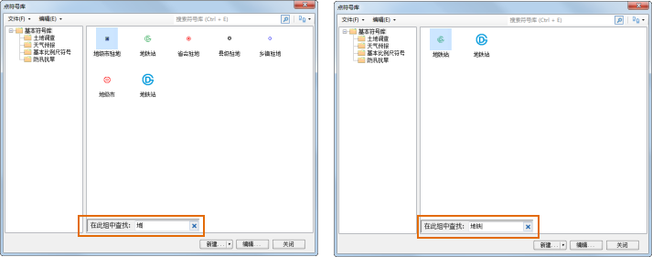
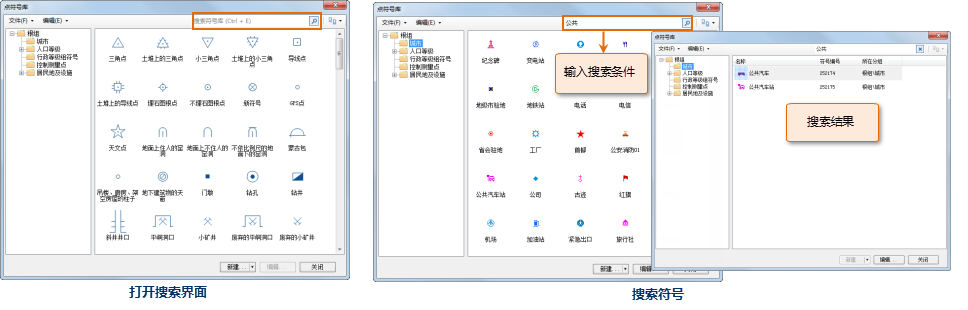

## 点符号库管理器界面结构

下图展示了点符号库管理器的界面布局：

* 菜单：菜单中组织了点符号库管理器提供的管理点符号库的相关功能。
* 搜索：根据用户输入的符号名称关键字以及符号编号，查找或搜索匹配的符号。
* 定制显示方式：显示方式的按钮，用来设置符号列表以哪种方式显示其中的符号，包括：以大图标显示符号，以详细信息方式显示符号。
* 符号分组结构树：通过“分组结构”按钮，可以显示或隐藏符号分组结构树。在符号分组结构树中，选择某个符号分组，可以使符号列表中显示该符号分组下的符号内容；符号分组结构树，也是管理符号库的分组结构的场所。有关符号分组的管理，请参见：[符号库分组结构管理](SymMarkerManager3)。
* 点符号列表：点符号列表用来显示当前符号分组中的所有点符号。
* 功能按钮：点符号库管理器下方的几个功能按钮分别用来新建点符号、编辑点符号库中已有的点符号以及关闭点符号库管理器窗口。

下文介绍了点符号库管理器中一小部分功能的使用，关于点符号库管理器的其他功能的使用，将在帮助文档中的其他页面进行详细介绍，用户可以查阅帮助文档的其他部分。

  

## 查找符号

通过 Ctrl + F
的组合键，可以在当前符号列表查找指定的符号。查找将基于符号的名称和符号的编号，将根据用户输入的文字或者数字，以这些文字和数字为匹配关键字，找出符号名称和符号编号与用户输入关键字相匹配的符号（查找范围为当前符号分组），使当前符号列表中只显示当前符号分组中满足条件的这些符号，而滤去其他符号不显示。

查找功能将根据所输入值实时进行查找并显示，即当查找框中的内容发生变化，就会执行一次查找操作。

查找后，如果要使符号列表中重新显示当前符号分组中的所有符号，只需将查找框中的文字内容清空或者关闭查找框即可。

  

如下图所示，在查找框中中顺次输入“地”和“铁”两个文字，第一次将当前符号分组中，符号名称包含有“地”字的符号全部查找出来并显示；继续输入“铁”，那么符号名称中同时包含“地铁”两个字的符号全部查找出来并显示。

在查找框中输入数字“12”，符号编号中含有“12”数字的符号全部查找出来并显示。另外，如果符号的名称中也含有数字“12”，那么，这些符号同样也会被查找出来。

  

## 搜索符号

搜索符号可以在当前整个符号库中搜索满足特定条件的符号，搜索也是基于符号的名称和符号的编号，搜索将根据用户输入的文字或者数字，以这些文字和数字为匹配关键字，搜索出符号名称和符号编号与用户输入关键字相匹配的符号，并且搜索的范围为整个符号库，搜索完成后，符号列表中将显示符号库中所有符合搜索条件的符号。

如下图所示，在符号库管理器中，单击“搜索”按钮，将显示如下搜索界面，同时关闭符号分组结构树；在文本框中输入搜索条件，例如：输入“公共”，然后单击文本框下方的“搜索”按钮，开始搜索整个符号库，搜索的结果将显示在右侧的符号列表中，在搜索结果中将显示符号所在的符号分组信息、符号名称以及符号编号。

   

## 符号列表显示方式

符号库管理器中，在符号列表的右上角的下拉按钮，可以控制符号列表中的符号分别以大图标、详细信息方式显示。

此外，在符号列表的任意位置，右键鼠标，弹出如下所示的右键菜单，通过右键菜单中的“显示方式”的次一级菜单，也可以定制符号列表的显示方式。

  
