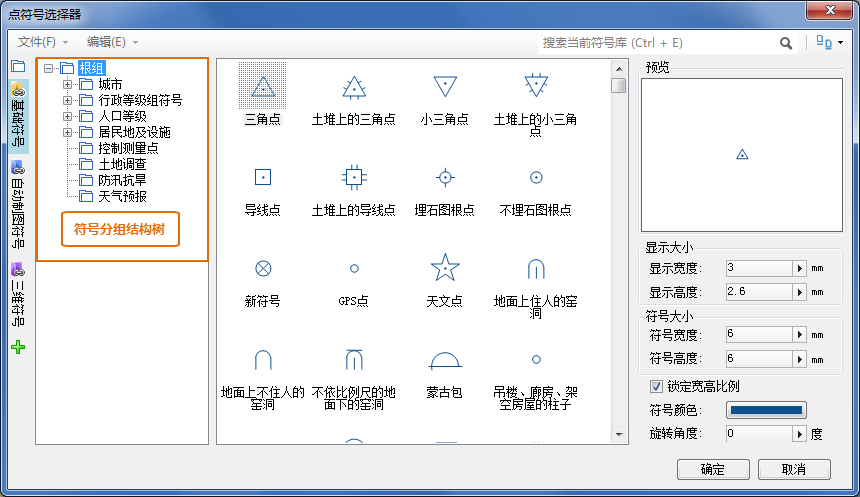

符号库分组结构，即符号库的逻辑存储结构，请参见 [符号库逻辑存储结构](SymMarkerManager10.htm) 。

下面将介绍如何通过界面交互操作，实现符号库分组结构的管理。以下操作以点符号库为例，介绍如何在符号选择器中进行符号分组的管理，对于线型符号库和填充符号库，可以采用相同的方式，在相应的符号管理器中完成符号库分组结构的管理。

在符号选择器中，符号分组结构树是进行符号逻辑分组管理的区域，可以通过符号选择器中的“分组结构”按钮，控制符号选择器中的符号分组结构树是否显示。

在符号选择器中，符号分组结构树所提供的管理符号分组的交互操作基本都是基于树节点的右键菜单实现符号分组的管理操作。

  

### 新建/删除/重命名符号分组

**新建符号分组：**

1. 确定在哪个符号分组下建立新的符号分组。在符号分组结构树中，右键单击目标符号分组；
2. 在弹出的右键菜单中，选择“新建组”，新建的符号分组将出现在其所在的目标分组的结点下，新建的符号分组的名称为默认名称。

另外，可以通过符号库选择器中的“编辑”菜单下的“新建组”，进行符号分组的创建。具体操作为：首先，在符号分组结构树中选中要新建符号分组的某个符号分组；然后，单击“编辑”菜单下的“新建组”。

**删除符号分组:**

1. 确定删除哪个符号分组。在符号分组结构树中，右键单击目标符号分组；
2. 在弹出的右键菜单中，选择“删除”，弹出确认删除对话框，单击“确定”，将删除该分组和该分组下的其他符号分组和所有的符号内容。

删除符号分组，也可以在符号分组结构树中，选中要删除的符号分组，按 Delete 键来删除。

另外，可以通过符号库选择器中的“编辑”菜单下的“删除”，删除符号分组。具体操作为：首先，在符号分组结构树中选中要删除的符号分组；然后，单击“编辑”菜单下的“删除”。

**重命名符号分组：**

1. 确定要修改哪个符号分组的名称。在符号分组结构树中，右键单击目标符号分组；
2. 在弹出的右键菜单中，选择“重命名”，该符号分组的名称变为可编辑状态，输入新的名称即可。

还可以通过符号选择器中的“编辑”菜单下的“重命名”，重命名符号分组。具体操作为：首先，在符号分组结构树中选中要重命名的符号分组；然后，单击“编辑”菜单下的“重命名”。

此外，通过以下方式也可以将符号分组名称切换为可编辑状态：方式一：选中需要重命名的符号分组，然后按 F2 键；方式二：选中需要重命名的符号分组，然后，在该符号分组上再次单击鼠标。

### 改变符号的逻辑存放位置

改变符号的逻辑存放位置，即改变符号所在的分组，这种改变只是改变的符号的逻辑存放位置，不会改变符号在整个符号库中的符号编号。

1. 在点符号管理器的点符号列表中，选中需要改变路径的符号，可以配合使用 Ctrl 键同时选中多个符号；
2. 在选中的任意一个符号上右键单击鼠标，在弹出的右键菜单中，选择“移动到”； 

“移动到”的子菜单列出了当前点符号库逻辑管理组织的分组层次结构，并通过菜单和子菜单的形式，对应表达该分组层次结构。

3. 选择要将选中的符号存放到的符号分组，即可将该符号从当前路径下移动到指定的目标路径下。

### 改变符号分组结构

这里主要是进行符号分组合并操作，即将某个符号分组连同其符号分组结构及其中的符号移动到其他符号分组下。

1. 在“符号分组结构树”中，右键单击需要移动的某个符号分组节点；
2. 在弹出的右键菜单中，选择“合并到”； 

“合并到”的子菜单列出了当前点符号库逻辑管理组织的分组层次结构，并通过菜单和子菜单的形式，对应表达该分组层次结构。

3. 选择要将选中的符号分组合并到（移动到）的符号分组，即可将该符号分组连同其符号分组结构及其中的符号移动到目标符号分组下。 

如果被合并的点符号分组的名称与合并到的目标符号分组下的其他子符号分组的名称重名，系统将自动更改被合并的符号分组的名称。

此外，在符号分组结构树中，可以通过拖拽的方式改变某个符号分组的路径，即实现合并符号分组的操作：

1. 在“符号分组结构树”中，选中需要移动的某个符号分组节点；
2. 在选中的符号分组节点上，按住鼠标左键不放，拖动鼠标；
3. 确定要将选中的符号分组合并到的目标符号分组，在目标符号分组节点释放鼠标左键，实现符号分组的合并操作。选中的符号分组连同其符号分组结构及其中的符号移动到目标符号分组下。

### 复制/粘贴点符号和点符号分组

不能将符号库的根组复制到其他符号分组中。

**复制/粘贴点符号**

1. 在点符号管理器的点符号列表中，选中需要复制的符号，可以配合使用 Ctrl 键同时选中多个符号；
2. 在选中的任意一个符号上右键单击鼠标，在弹出的右键菜单中，选择“复制”；或者，选择符号选择器中“编辑”菜单下的“复制”项；
3. 定位到要将选中的符号复制到的目标路径，则点符号列表中将显示当前路径下的符号；
4. 在符号列表中，在任意空白位置单击鼠标右键，在弹出的右键菜单中选择“粘贴”，即可将选中的符号复制到该符号分组中；或者，选择符号选择器中“编辑”菜单下的“粘贴”项完成粘贴操作。

**复制/粘贴点符号分组**

1. 在“符号分组结构树”中，右键单击需要复制的某个符号分组节点；
2. 在弹出的右键菜单中，选择“复制”；或者，选择符号选择器中“编辑”菜单下的“复制”项；
3. 同样，在“符号分组结构树”中，右键单击要将 **所复制** 的符号分组 **复制到** 的目标符号分组节点；
4. 在弹出的右键菜单中，选择“粘贴”，即可将该符号分组及分组下的所有内容一起复制到目标符号分组中，所复制的符号分组成为目标符号分组的子符号分组；或者，选择符号选择器中“编辑”菜单下的“粘贴”项完成粘贴操作。

如果所复制的点符号分组的名称与目标符号分组下的其他子符号分组的名称重名，复制操作将失败，并弹出警示对话框。

