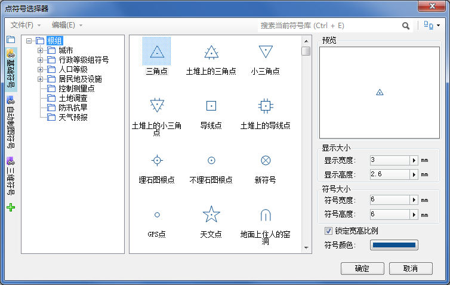

点符号选择器主要用来管理点符号库中的点符号，包括管理点符号库的逻辑存储结构，添加/删除符号，导入/导出符号等。对点对象进行风格设置时，在点符号选择器中可以设置所使用的点符号，设置点符号的大小、颜色等风格。

  

  
### 如何使用点符号选择器

下面的表格是将点符号选择器所提供的功能进行分类，每一部分包含了点符号选择器的若干项功能点。用户可以使用下面的表格定位所需要了解的功能的使用方法，并且每一部分功能的使用指南都包含了详细的使用步骤以及对操作过程进行录制的图像。

功能分类 | 包含的功能点简介  
---|---  
[打开点符号选择器](SymMarkerSelector1) | 打开点符号选择器。  
[点符号选择器界面简介](SymMarkerSelector2) | 点符号选择器的界面结构，介绍各部分的作用和使用方式。  
[设置点符号风格](SymMarkerSelector3) | 使用点符号选择器设置点符号风格。  
[加载更多符号库](SymMarkerSelector4) | 在符号选择器中加载更多符号库文件对应的符号库进行符号应用。  
[符号库逻辑存储结构](SymMarkerManager10) | 详细介绍符号库所采用的逻辑存储结构，即以 **“符号分组”**的形式分门别类地存放符号。  
[符号库分组结构管理](SymMarkerManager3) |对点符号库的符号分组进行管理，如：新建/移除符号分组，改变符号所在的符号分组，复制/粘贴点符号和点符号分组。  
[导入导出点符号库文件](SymMarkerManager4) | 打开点符号库文件； 加载默认点符号库； 查看符号库属性信息；  导入点符号库文件；   将当前点符号库导出为点符号库文件；   导出指定点符号分组中的点符号到点符号库文件；   导出指定点符号到点符号库文件。  
[导入点符号](SymMarkerManager5) | 将其他点符号库文件中的符号导入到当前点符号库中；   导入栅格图像作为点符号添加到当前点符号库中；   导入 TrueType 字体作为点符号添加到当前点符号库中；   导入 AutoCAD 矢量图形文件作为点符号添加到当前点符号库中。  
[导出点符号为图片](SymMarkerManager6) | 将当前点符号库中选中的某个点符号导出为图片。  
[新建点符号](SymMarkerManager7) | 新建一个点符号，简单制作一个点符号，并添加到当前点符号库中。  
[编辑点符号](SymMarkerManager8) | 编辑点符号库中的某个符号，包括栅格点符号编辑和矢量点符号编辑。  
[保存工作成果](SymMarkerManager9) | 通过点符号库文件保存工作成果；   通过工作空间保存工作成果。  

