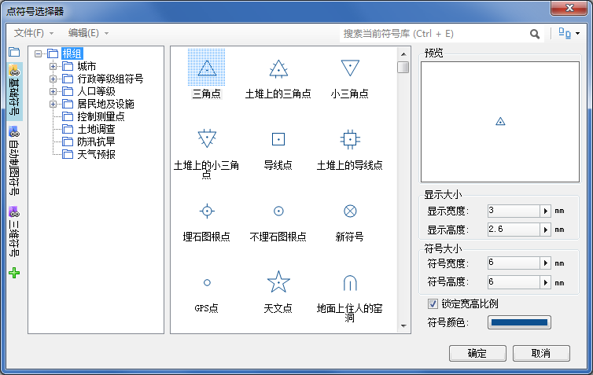

点符号选择器，可以对点对象进行风格设置，包括选择点符号，设置符号大小、旋转、颜色等风格；用户可以通过以下两种方式来打开点符号选择器：

* **双击“点符号库”子节点**
* **通过右键菜单加载点符号库**

下面将对打开点符号选择器的两种方式分别进行介绍。

### 双击“点符号库”子节点

1. 打开SuperMap iDesktop 应用程序，展开工作空间管理器的资源节点；
2. 如下图所示，双击资源节点下的点符号库子节点，弹出点符号库选择器。
  
---  
弹出点符号库选择器  

### 通过右键菜单加载点符号库

1. 打开SuperMap iDesktop 应用程序，展开工作空间管理器的资源节点；
2. 如下图所示，右键点击点符号库子节点，在弹出右键菜单中，选择“加载点符号库...”菜单项，弹出点符号库选择器。

需要注意的是，如果当前打开了已存在的工作空间，则打开的点符号库选择器当前所管理的是存储在该工作空
